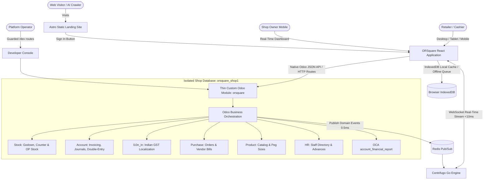

# ORSquare Project Context & Architecture

**Project:** ORSquare (OR²)  
**Current Phase:** Architecture & Research Phase  
**Locked Baseline:** Odoo 18.0 Community Edition Engine + Mature OCA Modules + Thin Custom `orsquare` Module + Custom React Frontend + Separate Static Astro Marketing Landing Page.

---

## 1. Executive Summary & Product Vision

ORSquare is a high-speed retail operations platform designed specifically for bottle, beverage, and retail counters, featuring an optional restaurant/table billing mode.

### Core Philosophy
* **Simplicity at the Front, Rigor at the Back:** Normal users never interact with Odoo's standard ERP web client. They interact with an ultra-clean, lightning-fast custom ORSquare interface built for cashiers, stockkeepers, and shop owners.
* **Backend-First Validation:** Build and validate the complete Odoo-side foundation and workflows inside the `orsquare` module first. Only after the business engine is verified correct do we attach and clean the custom React frontend.
* **Standard Odoo Engine:** Odoo 18 Community handles double-entry accounting, inventory moves, purchases, GST compliance (`l10n_in`), and employees natively.
* **Astro Marketing Separation:** The public marketing site runs on the lightweight Astro framework for maximum SEO, semantic crawler indexing (`llms.txt`), and instant loading, while seamlessly directing authenticated users to the ORSquare application.

---

## 2. Key Architectural Decisions (Research Findings)

### A. Tenancy: Separate Database per Shop (Database-per-Tenant)
* **Model:** One account = one shop = one database (`orsquare_shop1`, `orsquare_shop2`).
* **Multi-Shop Canceled:** Cross-shop multi-store owner management has been explicitly removed in favor of maximum simplicity and reliability.
* **Why Database-per-Shop is Superior:**
  1. **Absolute Security Isolation:** Physical separation at the PostgreSQL level prevents any cross-tenant data leaks.
  2. **Safe "Wipe Shop Data":** Wiping or resetting a shop's operational data can never corrupt or touch another shop's database.
  3. **Granular Backups & Restores:** Each shop has an independent backup file and can be restored to any point in time without affecting other businesses.
  4. **Zero Cross-Shop Lock Contention:** High-traffic billing in one shop never blocks database sequences or inventory rows in another.

### B. Offline POS & Local-First Architecture: Dexie.js + Durable Outbox
* **Status:** Locked Decision (performance metrics are benchmark targets to validate during implementation).
* **Why Not Re-skin Odoo's Internal POS?** Odoo 18's POS frontend is tightly coupled to OWL (Odoo Web Library). Re-skinning OWL with React is an unmaintainable hybrid anti-pattern.
* **The Proven Solution:** The custom React frontend uses **Dexie.js** (IndexedDB) as its local database and an **in-memory object pool** for instant local querying.
* **Single-Roundtrip Bootstrap Bundle:** A single endpoint (`/api/sync/bootstrap`) delivers the complete compressed shop seed (manifest, catalog, stock levels, open bottles, active daybook, permissions) on initial load, completely eliminating the legacy waterfall of 20+ sequential network requests. Subsequent loads render from local IndexedDB instantly, followed by incremental delta sync (`/api/sync/delta?since_seq=...`).
* **Durable Transactional Outbox:** Offline operations (sales, transfers, bottle openings) commit atomically to an `outbox_mutations` table with client UUIDs (`client_order_ref`). When reconnected, batches flush idempotently to Odoo (`/api/sync/flush`).
* **Physical Stock Conflict Handling:** If two offline terminals sell the same last physical unit, both sales are accepted into the append-only sales log upon reconnection. Physical stock discrepancies are flagged and surfaced during the **Daybook closing physical count audit** for owner reconciliation, reflecting physical reality without disrupting completed counter checkouts.
* **Benchmark Target Principle:** Specific metrics (e.g. sub-millisecond local queries, ~150ms bootstrap, ~200KB bundle sizes) are treated as **benchmark engineering targets**, to be rigorously measured and validated against actual code.

### C. Responsive Frontend Strategy
* **Desktop:** High-density, keyboard-driven layout with instant function-key shortcuts (F1-F12 for scanning, holding, and settling).
* **Tablet:** Dual layout support: can toggle between a desktop-style overview or a touch-friendly mobile layout.
* **Mobile:** Not a scaled-down desktop UI; features a dedicated bottom navigation bar, touch-friendly $\ge 44$px targets, full-screen camera barcode scanning, and thumb steppers.

### D. Open Bottles (Peg & Portion Sales)
* **Status:** Locked Decision (Alternative B: Fractional UoM with 6-Decimal Precision).
* **Product Feature:** Allows selling portion sizes (e.g. 30ml, 60ml, 90ml, 120ml, 150ml) from opened bottles (750ml, 700ml, 650ml, 375ml, 180ml, 1000ml).
* **Strict UI Presentation Boundary:** Cashiers and store owners interact purely in physical milliliters (`ml`); fractional bottles (e.g. `0.085714`) are strictly internal backend quantities and are never exposed in the user interface.
* **UI Implementation:** 
  - Persistent **Open Bottles Tray** carousel along the bottom of the Sales screen with visual bottle fill levels (Green >50%, Amber 25-50%, Red <25%).
  - Slide-out **Open Bottle Drawer** for choosing peg size, source bottle, and selling rate.
  - References: [`C:\Users\rushi\Desktop\ref\01.png`](file:///C:/Users/rushi/Desktop/ref/01.png) and [`C:\Users\rushi\Desktop\ref\02.png`](file:///C:/Users/rushi/Desktop/ref/02.png).
* **Inventory Authority & Accounting Mechanics:**
  - **Single Inventory Authority Invariant:** Odoo stock quantities (`stock.quant`), stock moves (`stock.move`), stock valuation layers (`stock.valuation.layer`), and double-entry accounting ledgers are the **sole authoritative truth** for stock and valuation. The operational model `orsquare.opened_bottle` is strictly a tracking and UI presentation record that references underlying stock items/moves and derives or validates remaining physical volume; it **must never become a parallel inventory or valuation ledger**.
  - **Opening a Bottle:** Uncorking transfers 1 unit from `WH/Stock/Counter` to `WH/Stock/Opened`.
  - **Odoo-Native Fractional Stock Movement for Portion Dispensing:** Portion sales execute native stock moves using the bottle UoM configured with 6-decimal precision:
    $$\text{Portion Quantity (bottles)} = \frac{\text{Portion ml}}{\text{Bottle Capacity ml}}$$
    Odoo's native AVCO stock valuation layers calculate and post exact Cost of Goods Sold (COGS) without any custom costing engine:
    $$\text{Portion COGS} = \text{Portion Quantity} \times \text{Bottle Unit Cost}$$
  - **Precision Specification & Invariant Qualification:**
    > **ORSquare uses 6-decimal precision for the bottle UoM as the validated minimum for the tested bottle/portion combinations. This is an implementation requirement backed by automated regression tests, not a universal mathematical guarantee for every possible future bottle size or portion. Any new supported bottle/portion configuration must pass the same valuation/conservation tests.**
  - **Container-Level Verification Mandate:** The runtime behavior of `decimal.precision` (`Product Unit of Measure` = 6) and `uom.uom.rounding` (`0.000001`) must be verified against the exact Odoo 18 Community container build used in production.
  - **Residual Wastage & Zeroing Invariant:** Un-sellable residuals or breakage are cleared via `stock.scrap` evaluated against the exact stored remaining quant (`scrap_qty = remaining_quant`). This cleanly zeroes out the physical quant to `0.000000` and flushes the residual asset value to `₹0.00`, preventing phantom quant dust or stranded pennies.
  - **Permanent Automated Regression Suite:** The 5-bottle empirical multi-step conservation tests (750ml, 700ml, 650ml, 375ml, 1000ml) are preserved as permanent automated regression tests inside the `orsquare` test suite.

### E. Real-Time Event Stream: Centrifugo (Go) + Redis (C)
* **Status:** Locked Decision (pending final benchmark validation).
* **Architecture:** Decouples the fast user sensation from deep accounting bookkeeping:
  - Cashier commits transaction in React POS.
  - Odoo 18 Community processes double-entry ledger & emits a tiny domain event (`sale_settled`) to Redis.
  - **Centrifugo (Go)** broadcasts the event over WebSockets to connected screens (owner mobile, secondary registers) in <10 ms.
  - Odoo workers never hold idle WebSockets or manage live connection pools.
  - Built-in message history cache allows mobile devices waking from sleep to silently recover missed events without querying PostgreSQL.

### F. Kitchen Universal Extension (Infinite Stock)
* **Status:** Locked Decision.
* **Architecture:** Universal toggle inside Business Studio. Does not introduce a separate subsystem or parallel database.
* **Native Odoo Mapping:** Kitchen dishes map to standard Odoo consumables (`detailed_type = 'consu'`, `is_kitchen = True`).
  - Selling kitchen dishes at POS posts revenue and tax accounts normally, but **bypasses stock delivery pickings and quant deductions** ("infinite stock").
  - Recipes, raw materials, BOMs, kitchen inventory, and costing are excluded at this stage.
  - Non-kitchen shop consumables (peanuts, cashews, snacks) are supported as tracked storables (`detailed_type = 'product'`) or untracked counter items (`detailed_type = 'consu'`).

### G. Two-Tier Unit Standardization System & Portion Variants
* **Status:** Locked Decision.
* **Architecture:**
  - **Tier 1 (Standard Base Units):** Platform-level defaults (`ml`, `L`, `Piece`, `Pack`, `Plate`, `Bowl`, `Kg`, `gm`) shipped by ORSquare. Immutable and non-deletable. Shop owners control shop visibility via an **Eye Toggle**. (Non-destructive: hiding a base unit only excludes it from new creation UIs; existing derived shop units and products continue to work and compute volume normally).

  - **Tier 2 (Shop Units):** Derived by shops from active visible Base Units with strict numeric conversion ratios (e.g. `180 ml`, `Pack of 10`), guaranteeing exact liquid volume calculations in Liters for excise/statutory reporting.
* **Portion Variants (Half & Full Portions):** Eliminates fragile legacy duplicate products (`Name (Half)`). Managed natively as Odoo Product Variants (`product.template` + `Portion` attribute) under a simple Full/Half toggle in the UI, preserving single parent naming, categories, and unified sales analytics.
* **Catalog Masters Drawer:** Renamed from *"Catalog Options"* to **"Catalog Masters"** with dedicated visual sections for Base Units and Shop Units.

### H. Advanced Billing Architecture & Dual Bill Templates
* **Status:** Locked Decision.
* **Architecture:**
  - **Core Architectural Principle:** **ORSquare simplifies the user's actions; Odoo remains responsible for the accounting, inventory valuation, tax calculation, and ledger truth.**
  - **Two-Tier Billing:** Simple Bill (default 10-second workflow for everyday counter operations) vs. Advanced Bill (`[✓] Advanced Bill` toggle for supplier invoice reproduction and B2B wholesale invoices).
  - **Multi-Tax Regimes & Configurable Tax Mappings:** Constitutional separation between Alcoholic Liquor for human consumption (outside GST per Art. 366(12A) & Sec. 9(1) CGST Act, subject to State VAT/excise levies + Sec. 206C(1) TCS) and General Retail Merchandise (subject to CGST/SGST/IGST). Uses configurable statutory tax regimes and Odoo fiscal mappings (`account.fiscal.position`), with Maharashtra as initial reference setup but fully configurable for any state without hard-coded state names or rates.
  - **Commercial Adjustments & Native Landed Costs:** Item-level discounts (%/₹), prorated bill-level trade discounts, and capitalized landed costs. The ORSquare checkbox (`[✓] Capitalize into Inventory Cost`) is strictly a UX control; actual valuation is performed 100% by Odoo's native landed-cost mechanism (`stock.landed.cost`) into AVCO valuation layers (`stock.valuation.layer`). No parallel ORSquare costing engine is built.
  - **Bi-Directional Rate Engine:** Supports forward entry (`Qty × Rate = Total`) and reverse entry (`Qty + Total = Rate`), with explicit tax-exclusive base labeling and tax-inclusive reverse calculator.
  - **Costing Standard & Configurable Policy:** Moving Weighted Average Cost (AVCO via Odoo `property_cost_method = 'average'`) across all products, cleanly separating internal asset valuation from legal supplier payables. Granular settings switches give shop owners total control over whether discounts, freight/expenses, and taxes are factored into product cost rates.
  - **Tax Override & Penny Round-off:** Supports direct override of calculated tax to match printed supplier invoices, automatically booking penny differences ($\pm ₹5.00$) to the standard Round-off ledger.
  - **Dual Bill-Template System:** Dedicated template engines in Settings for **Large Format A4 Tax Invoices** (with statutory excise bottle breakdown matrix, bank details, dynamic UPI QR) and **Compact Thermal Slips** (58mm, 80mm).

### I. Operational Capabilities Roadmap (Refined Baseline)
* **Status:** Locked Decision (formalized based on live codebase audit and domain review).
* **Active (Keep Now & Redesign):**
  - **Auto-Godown Transfer on Checkout:** Single atomic Odoo database transaction (`with env.cr.savepoint():`) executing reservation, internal transfer, delivery, and invoice with row-level lock queueing on `stock.quant`. Zero overselling and zero negative stock is a core invariant proven through concurrent integration and load tests, with Odoo's native reservation machinery acting as the sole authority.
  - **Continuous Scanning Mode:** Barcode stream with UI lock/unlock protection and durable IndexedDB draft buffer.
  - **Independent Default Payment Mode:** Dedicated registers (Cash-only counter vs. Card/UPI counter) via client-side local settings.
  - **Granular Cashier Permissions & Masking:** Hiding sensitive purchase rates, margins, and cost totals from staff without `can_see_valuation`.
  - **Transaction-Type-Aware Returns & Exchanges:** Paired transaction engine creating POS refund receipts and counter stock moves for retail sales, and formal statutory Credit Notes / Debit Notes for invoiced sales and vendor bills.
  - **Restaurant Floor & Table Setup:** Spatial visual table grid with visual state indicators and tab transfers.
  - **Three-Tier Hardware Thermal Printing Engine:** QZ Tray websocket $\rightarrow$ Local agent queue $\rightarrow$ Browser silent fallback. Benchmark targets (<100ms dispatch) measured under realistic load.
  - **Commercial Discounts vs. Concessions:** Explicit user classification between Trade Discounts (pre-tax base reduction), Statutory Round-off (Sec 170 CGST Act to nearest rupee), and Collection/Settlement Concessions (post-tax cash difference).
  - **Bill Finder:** High-speed client-side indexed search ("recognition over recall") targeting <10ms local lookups.
  - **Category Size Margin Pricing Rules:** Optional price-setting assistance rules attached to categories/pricing configs (`orsquare.margin_rule`), decoupled from physical `uom.uom`.
* **Milestone 1 Scope (Backend Engine Foundation):**
  - Thin custom module `orsquare` with minimal validated dependencies (`point_of_sale`, `stock_account`, `purchase_stock`, `stock_landed_costs`).
  - Tenant bootstrap with validated 6-decimal bottle UoM precision (`0.000001`).
  - Multi-location topology: `WH/Stock/Godown`, `WH/Stock/Counter`, and `WH/Stock/Opened`.
  - Operational Open Bottle tracking record (`orsquare.opened_bottle`) referencing stock quants/moves without acting as a parallel ledger.
  - Operational business date cutoff attribution (`orsquare_business_date`), strictly separated from statutory accounting lock dates.
  - **Permanent Automated Invariant Regression Suite:**
    1. Multi-step Open Bottle conservation and zero-residual test across 5 bottle sizes (750ml, 700ml, 650ml, 375ml, 1000ml).
    2. Headless POS concurrency & negative stock / serialization test (from Milestone 0 Spike 1).
    3. Operational business date cutoff attribution invariants.
    4. Tenant bootstrap & decimal precision invariants.
* **Postponed (Future Scope):** Closing Stock Audit & Reconciliation Engine, and Indian Wine Shop Sheet Register & WineStock Matrix.
* **Skipped:** Product Master Library & Fuzzy Spreadsheet Importer. See [`docs/features-and-capabilities-spec.md`](docs/features-and-capabilities-spec.md).

---

## 3. High-Level System Architecture

---

## 4. Documentation Index

### Tab Specifications (`docs/tabs/`)
* [`docs/tabs/dashboard.md`](docs/tabs/dashboard.md) — Executive operational summary and owner rollup.
* [`docs/tabs/accounts.md`](docs/tabs/accounts.md) — Directory, customer Khata credit, supplier payables, employee advances, and party dossier.
* [`docs/tabs/ledger.md`](docs/tabs/ledger.md) — Business-wide Trial Balance, P&L, Balance Sheet, and tax reports.
* [`docs/tabs/purchases.md`](docs/tabs/purchases.md) — Procurement, Godown goods receipt, vendor bills, direct replacement exchange, and purchase returns.
* [`docs/tabs/products.md`](docs/tabs/products.md) — Master catalog, brand/variant/size hierarchy, opening stock, Open Bottle peg sizes, and simplified size margin helpers.
* [`docs/tabs/sales.md`](docs/tabs/sales.md) — Counter POS, continuous scanning with lock/unlock guard, independent payment mode, commercial discounts vs concessions, counter returns/exchanges, and Bill Finder.
* [`docs/tabs/stock.md`](docs/tabs/stock.md) — Godown & Counter topology, Auto-Godown transfer, stock transfer drawer, and OP Stock shelf. (WineStock matrix marked as Future Scope).
* [`docs/tabs/sheet.md`](docs/tabs/sheet.md) — Daily Counter Register matrix and statutory excise formulas (marked as Future Scope).
* [`docs/tabs/cashflow.md`](docs/tabs/cashflow.md) — Chronological cash diary, petty expenses, daily liquidity.
* [`docs/tabs/daybook.md`](docs/tabs/daybook.md) — Daily cash drawer session, opening float, expected cash, drawer count, and cash materiality threshold. (Closing stock audit marked as Future Scope).
* [`docs/tabs/calendar.md`](docs/tabs/calendar.md) — Historical business days, cutoff hour lock-in, frozen snapshots, audited Re-Audit.
* [`docs/tabs/settings.md`](docs/tabs/settings.md) — Appearance, bill/invoice format, three-tier thermal printing, redesigned restaurant tables setup, Business Studio, Staff Access data masking, and data control.

### Deep Architecture Research (`docs/`)
* [`docs/features-and-capabilities-spec.md`](docs/features-and-capabilities-spec.md) — Single master specification for all 16 operational capabilities, settings switches, and hardware drivers.
* [`docs/opened-bottles-spec.md`](docs/opened-bottles-spec.md) — Open Bottle portion/peg inventory, COGS valuation, wastage scrap, and UI reference mapping.
* [`docs/tenancy-and-offline-architecture.md`](docs/tenancy-and-offline-architecture.md) — Database-per-Shop, Dexie.js offline outbox, single bootstrap bundle, and physical stock conflict handling.
* [`docs/odoo-version-analysis.md`](docs/odoo-version-analysis.md) — Odoo 16 vs 17 vs 18 vs 19 evaluation.
* [`docs/odoo-module-architecture.md`](docs/odoo-module-architecture.md) — Core vs Official vs Industry Packages vs OCA vs Thin `orsquare` Module.
* [`docs/retail-workflow-spec.md`](docs/retail-workflow-spec.md) — Detailed operational mapping of retail workflows to Odoo.
* [`docs/data-control-and-wipe.md`](docs/data-control-and-wipe.md) — Safe operational data wipe architecture, PostgreSQL integrity, and pre-wipe backup design.
* [`docs/existing-repos-audit.md`](docs/existing-repos-audit.md) — Deep audit of legacy repositories (`production-hot-fix` and `orsquare-tryton`).
* [`docs/astra-landing-optimization.md`](docs/astra-landing-optimization.md) — Astro landing page SEO, accessibility, performance, and seamless login integration.
* [`docs/kitchen-and-units-spec.md`](docs/kitchen-and-units-spec.md) — Kitchen universal extension (infinite stock consumables), Two-Tier Units (Base Units with visibility toggles, Shop Units with numeric conversion ratios), portion variants, and Catalog Masters drawer redesign.
* [`docs/advanced-billing-spec.md`](docs/advanced-billing-spec.md) — Advanced Purchase & Sales Billing specification, Two-Tier progressive disclosure, capitalized landed costs vs period expenses, AVCO moving average costing, bi-directional rate entry, tax override & penny rounding, and Dual Bill Templates (A4 & Thermal).

