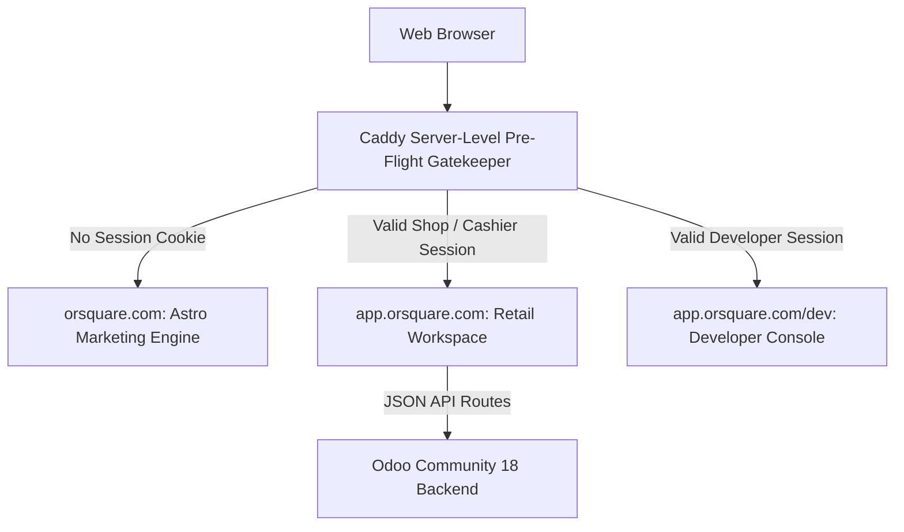

# Astro Landing Page Audit & Crawler/SEO Optimization Guide

> **Status review — 2026-10-07:** The Astro site has been imported. This document records the optimization direction; production delivery and public-domain routing remain unverified. See [current status](../STATUS.md).

**Framework:** Astro 5.6.1 (Static Site Generation / Prerendered)  
**Reference Source:** `C:\Repo\orsquare-tryton\landing`  
**Goal:** Maximum SEO visibility, zero latency, deep AI/crawler readability, and seamless transition into the ORSquare React application.

---

## 1. Current State Audit & Strengths

The landing page implementation in `orsquare-tryton/landing` represents an exceptionally high engineering standard:

1. **Architecture:** Pure Static Site Generation (SSG) with `prerender = true`. Zero client-side JavaScript framework bloat.
2. **Design Discipline (`QUALITY.md`):** Strict IBM Carbon square aesthetic (0px radius, 1px hairlines, Plex Sans typography, 1 chromatic accent `#0f62fe`, no shadows, no pills).
3. **Privacy & Security:** 100% self-hosted fonts; zero 3rd-party tracking scripts, cookies, or external CDN dependencies.
4. **AI Crawler Readiness:** Native `llms.txt.ts` route providing structured, clean plain-text information specifically for LLMs and conversational search engines (Perplexity, ChatGPT, Claude, Gemini).
5. **Existing Structured Data:** Comprehensive JSON-LD scripts for `Organization`, `SoftwareApplication`, `BreadcrumbList`, and `FAQPage`.

---

## 2. Additional Recommended Optimizations

To elevate the marketing presence even further, the following optimizations should be incorporated:

### A. AI Crawler & Modern Search Engine Optimizations
* **Implement `llms-full.txt`:** The AI crawler community (endorsed by Perplexity, Anthropic, and OpenAI) has evolved to look for both `llms.txt` (a brief summary index) and `llms-full.txt` (a complete, un-truncated plain text dump of the entire product documentation and capabilities).
* **Enhanced Schema.org Definitions:**
  * Add `LocalBusiness` / `Store` / `FinancialService` schema to support search results for regional retail software queries.
  * Add `Speakable` specification to key FAQ items to allow Google Assistant and conversational AI voice bots to read answers directly.
* **Semantic HTML Content Layering:** Ensure every hand-drawn UI screen illustration includes an invisible `<div class="sr-only">` block describing the business scenario depicted in the illustration, allowing crawlers and screen readers to extract full semantic meaning.

### B. Core Web Vitals & Performance Enhancements
* **Critical CSS Inlining:** Astro automatically inlines scoped CSS, but ensuring global variables and Plex font-face declarations are inlined in `<head>` prevents any flash of unstyled text (FOUT).
* **Font Preloading:**
  ```html
  <link rel="preload" href="/fonts/plex-sans-latin-300.woff2" as="font" type="font/woff2" crossorigin>
  <link rel="preload" href="/fonts/plex-sans-latin-400.woff2" as="font" type="font/woff2" crossorigin>
  ```
  Adding `font-display: swap` ensures instant text rendering (LCP < 0.8s on 4G).
* **Zero Cumulative Layout Shift (CLS):** Explicit `width` and `height` attributes on all SVG logos and drawn screen wrappers to guarantee a CLS score of 0.000.

### C. Accessibility (WCAG 2.2 AA / AAA)
* **Skip-to-Content Link:** Add an accessible skip link as the very first element in the DOM:
  ```html
  <a href="#main-content" class="skip-link">Skip to main content</a>
  ```
* **Explicit Keyboard Focus Rings:** High-contrast focus state token (`outline: 2px solid #0f62fe; outline-offset: 2px`) for keyboard accessibility across all interactive links and buttons.
* **Micro-Label Contrast:** Audit muted labels in light mode to guarantee a minimum contrast ratio of 4.5:1 against the canvas background.

### D. Social Sharing & OpenGraph Meta Tags
* Ensure every page defines rich preview tags for WhatsApp, LinkedIn, and Twitter:
  ```html
  <meta property="og:title" content="ORSquare — Retail POS, Stock & Accounting" />
  <meta property="og:description" content="Simple counter billing, two-location stock (Godown & Counter), supplier dues, and daybook closing for retail shops." />
  <meta property="og:image" content="https://orsquare.com/og/preview.png" />
  <meta name="twitter:card" content="summary_large_image" />
  ```

---

## 3. Seamless Landing-to-Application Integration Architecture (Locked Guardrail)

To permanently prevent authenticated users from ever seeing the public marketing page or getting kicked out on refresh, the integration uses a **Server-Level Pre-Flight Gatekeeper** implemented in **Caddy**:



### 1. Hard Domain & Routing Boundaries
* **Public Marketing Site:** `https://orsquare.com` (served statically by Astro).
* **Retail Application:** `https://app.orsquare.com` (served by React SPA).
* **Developer Console:** `https://app.orsquare.com/dev` (staff-gated).

### 2. Server-Level Pre-Flight Interception (Zero Landing Page Leakage)
* When any browser visits `https://orsquare.com`, Caddy evaluates the `httpOnly` session cookie **before transmitting any HTML**.
* If an active session exists:
  - **Shop Owner / Cashier:** Server immediately issues an HTTP 302/307 redirect to `https://app.orsquare.com`.
  - **Developer:** Server immediately issues an HTTP 302/307 redirect to `https://app.orsquare.com/dev`.
* Under no circumstances is landing page HTML sent to an already-authenticated user unless they have explicitly logged out.

### 3. The "Sign In" Button Experience
* In the Astro navigation header for unauthenticated public visitors, the **"Sign In"** button links directly to `https://app.orsquare.com/login`.
* Because both the Astro landing site and React application share the identical IBM Carbon design system (Plex Sans typography, `#0f62fe` accent, 1px hairlines, identical logo mark), clicking "Sign In" transitions cleanly into the login shell.
