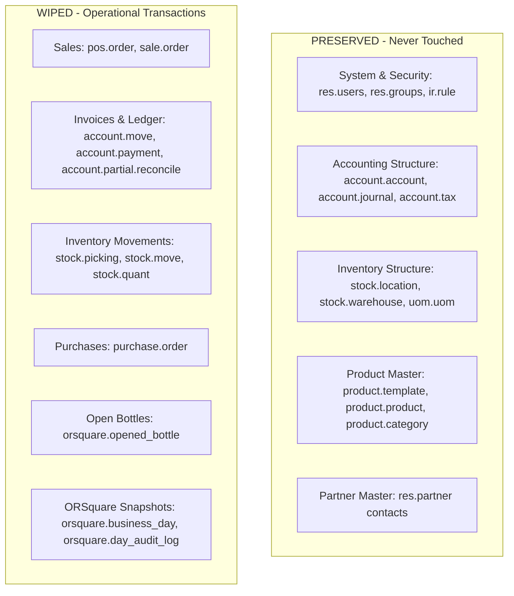
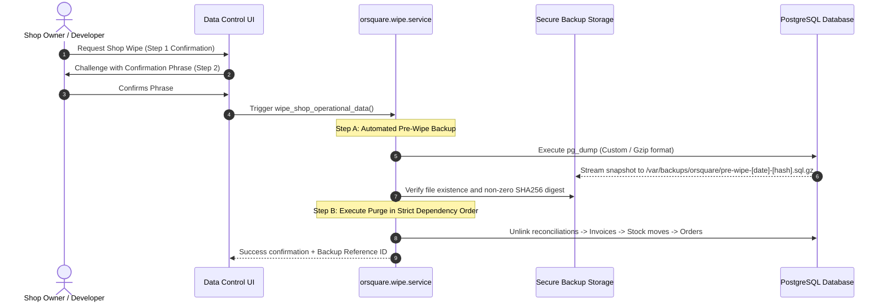

# Data Control & Safe Wipe Architecture

> **Status review — 2026-10-07:** Native wipe services and backend tests exist, but restored retailer wipe/restore controls are unavailable. A restore drill on another host remains pending; do not infer usable UI from this specification. See [current status](../STATUS.md).

**Project:** ORSquare (OR²)  
**Scope:** Data Lifecycle, Database Integrity, Automated Backups, and Safe Operational Wipe  
**Engine:** Odoo 18.0 Community / PostgreSQL  

---

## 1. Executive Summary & Objective

In retail deployments, shop owners occasionally need to reset their operational transactions—for example, clearing practice transactions after staff training, resetting figures prior to formal store launch, or clearing corrupt trial data.

However, in an ERP like Odoo, naive deletion of records (`DELETE FROM account_move`) can corrupt foreign key constraints, break the Chart of Accounts, and leave the database in an unrecoverable state.

This specification details a **100% safe, audited, two-step confirmed operational wipe mechanism** that resets transactional data while preserving master data, system configuration, and security structures—preceded by a mandatory, automated restorable backup.

---

## 2. Master Data vs. Operational Data Matrix

To ensure absolute safety, models are strictly segregated into two classes:



### Detailed Breakdown

| Category | Models | Wipe Status | Rationale |
|---|---|---|---|
| **System & Security** | `res.users`, `res.groups`, `ir.model.*`, `ir.rule`, `ir.config_parameter`, `res.company` | 🔒 **STRICTLY PRESERVED** | Critical system foundations. Wiping breaks login, permissions, and tenant isolation. |
| **Accounting Structure** | `account.account` (Chart of Accounts), `account.journal`, `account.tax` (GST), `account.fiscal.position` | 🔒 **STRICTLY PRESERVED** | Defines how double-entry bookkeeping functions. Must remain configured and ready. |
| **Inventory Locations** | `stock.location` (`WH/Stock/Godown`, `WH/Stock/Counter`, Customers, Vendors), `stock.warehouse`, `uom.uom` | 🔒 **STRICTLY PRESERVED** | Physical topology of the shop. |
| **Product Masters** | `product.template`, `product.product`, `product.category` | 🔒 **PRESERVED** | Preserves product names, barcodes, MRP, and selling rates so products do not need re-entry. |
| **Partner Masters** | `res.partner` (Customer, Supplier, Employee directory) | 🔒 **PRESERVED** | Preserves customer phone numbers, supplier contacts, and staff records. Balances are reset to ₹0. |
| **Accounting Ledger** | `account.move`, `account.move.line`, `account.payment`, `account.partial.reconcile` | 🧹 **SAFELY WIPED** | Clears all invoices, credit notes, payments, and general ledger journal entries. |
| **Stock Movements** | `stock.picking`, `stock.move`, `stock.move.line`, `stock.valuation.layer`, `stock.quant` | 🧹 **SAFELY WIPED** | Clears movement history; stock quants reset to 0 in both Godown and Counter. |
| **Orders & Procurements**| `purchase.order`, `sale.order`, `pos.order`, `pos.session` | 🧹 **SAFELY WIPED** | Clears purchase and sales documents. |
| **ORSquare Operations** | `orsquare.opened_bottle`, `orsquare.business_day`, `orsquare.day_audit_log` | 🧹 **SAFELY WIPED** | Resets open bottles on the shelf, daily cash floats, daybook sessions, and sealed day snapshots. |

---

## 3. Mandatory Pre-Wipe Backup Pipeline

A wipe operation must **never** begin without a guaranteed, verified backup stored in a protected developer/admin archive directory.

### Backup Execution Flow


---

> **As built:** the purge uses ordered SQL `DELETE` statements (children first), not ORM `unlink` and never `TRUNCATE … CASCADE` (it would reach `res_company` through `account_opening_move_id`). The backup is a verified `pg_dump` zip with its SHA-256 recorded in an immutable audit row. See decision D9 and `orsquare/models/wipe_service.py`. The sketch below is the original design intent.

## 4. Odoo Relational Integrity Purge Sequence

In Odoo, deleting records must follow a precise topological dependency order to prevent foreign key errors:

```python
# Conceptual Execution Sequence within an Atomic DB Transaction:
@api.model
def execute_safe_operational_wipe(self, shop_company_id):
    company = self.env['res.company'].browse(shop_company_id)
    
    # 1. Verification of Automated Backup
    backup_ref = self._create_pre_wipe_backup(company)
    assert backup_ref and backup_ref.verified, "Backup failed; aborting wipe."
    
    # 2. Break Accounting Reconciliations
    self.env['account.partial.reconcile'].search([
        ('company_id', '=', company.id)
    ]).unlink()
    
    # 3. Cancel and Unlink Invoices and Journal Entries
    moves = self.env['account.move'].search([('company_id', '=', company.id)])
    moves.button_draft()  # Reset posted moves to draft
    moves.unlink()
    
    # 4. Unlink Payments
    self.env['account.payment'].search([('company_id', '=', company.id)]).unlink()
    
    # 5. Purge Stock Moves and Pickings
    pickings = self.env['stock.picking'].search([('company_id', '=', company.id)])
    moves = self.env['stock.move'].search([('company_id', '=', company.id)])
    move_lines = self.env['stock.move.line'].search([('company_id', '=', company.id)])
    
    move_lines.unlink()
    moves.unlink()
    pickings.unlink()
    
    # 6. Reset Stock Quants to Zero across all internal locations
    quants = self.env['stock.quant'].search([('company_id', '=', company.id)])
    quants.unlink()
    
    # 7. Unlink Purchase & Sale Orders
    self.env['sale.order'].search([('company_id', '=', company.id)]).unlink()
    self.env['purchase.order'].search([('company_id', '=', company.id)]).unlink()
    
    # 8. Reset Open Bottles Shelf
    self.env['orsquare.opened_bottle'].search([('company_id', '=', company.id)]).unlink()
    
    # 9. Reset ORSquare Session Records
    self.env['orsquare.business_day'].search([('company_id', '=', company.id)]).unlink()
    
    # 10. Audit Log Entry
    self.env['orsquare.console_audit'].create({
        'action': 'OPERATIONAL_DATA_WIPED',
        'company_id': company.id,
        'user_id': self.env.user.id,
        'backup_reference': backup_ref.name,
    })
    
    return {'status': 'success', 'backup_ref': backup_ref.name}
```

---

## 5. User Interface & Two-Step Confirmation UX

The Data Control tab features a dedicated **Wipe Shop Data** panel designed to prevent accidental triggers:

1. **Step 1 (Warning & Scope Modal):**
   * Clear list of what will be cleared (all sales, bills, stock counts, daybook history).
   * Clear list of what will be preserved (products, catalog prices, barcodes, customer names).
   * Notice that an automated backup will be generated and archived.
2. **Step 2 (Friction & Explicit Challenge):**
   * The user must manually type the shop's registered name (e.g., `Shri Krishna Wines`) and enter their administrator password.
   * The "Wipe and Reset to Fresh" button only becomes active once both inputs match precisely.
3. **Completion Screen:**
   * Displays the unique Backup Reference ID (e.g., `BAK-20261006-SKW-78A9`).
   * Explains that if the wipe was triggered in error, platform developers can restore the database within minutes using this reference ID.
