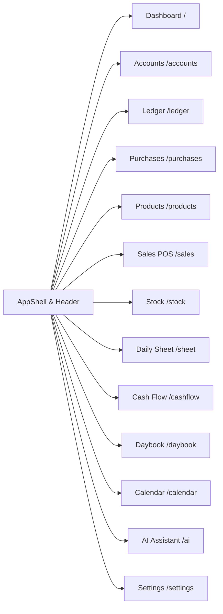

# Deep Audit of Existing Repositories

**Audited Repositories:**
1. **Repository 1 (Retailer Application):** `C:\Users\rushi\Music\production-hot-fix`
2. **Repository 2 (Developer Console & Landing Page):** `C:\Repo\orsquare-tryton`

---

## 1. Audit of Repository 1: `production-hot-fix`

### High-Level Profile
* **Frontend Tech Stack:** React 19, TypeScript, Vite, Tailwind CSS, Token CSS (`tokens.css`, `financial-semantic.css`).
* **Design Language:** Clean, dense, data-rich IBM Carbon / industrial aesthetic. Square 0px/2px borders, hairline 1px borders, subtle surface layer transitions, strict semantic color tokens (`--dr-fg`, `--cr-fg`, `--layer-accent`).
* **Legacy Backend:** Discontinued Django monolith (13 apps: `core`, `catalog`, `library`, `inventory`, `sales`, `purchases`, `accounts`, `cashflow`, `daybook`, `sheet`, `capabilities`, `distribution`, `console`).
* **Root Cause of Backend Failure:** Attempted to manually build a custom double-entry accounting engine, custom stock movement ledger, custom cash session math, and sync everything asynchronously to Odoo over a transactional outbox. This created severe synchronization desyncs, calculation drifts between reports, double-posting bugs on retries, and data corruption in sealed historical periods.

---

### Comprehensive Retailer Tabs & Screen Inventory

#### 1. Dashboard (`/`)
* **File:** `src/pages/DashboardPage.tsx` & `src/pages/OwnerDashboardPage.tsx`.
* **Components & Widgets:**
  - *Today Banner:* Gross sales, bill count, average bill size, cash collection vs. UPI collection, simple gross profit indicator.
  - *Needs Attention Card:* Real-time alerts for low-stock SKUs, overdue Khata customer receivables, and cash drawer discrepancies.
  - *Weekly Trend Chart:* 7-day visual graph of daily sales volume.
  - *Stock Position Card:* Current stock valuation divided by location (**Godown** vs. **Counter**).
  - *Quick Action Floating Bar:* One-tap buttons for New Sale, Record Purchase, Transfer Stock, New Cash Entry, Import Products.
* **Owner Dashboard Variant (Legacy):** In the legacy repo, this was intended for multi-shop rollups; however, multi-shop management has been explicitly canceled in ORSquare in favor of strict single-shop accounts (`orsquare_shop1`). Each shop uses the standard focused dashboard.

#### 2. Accounts (`/accounts`) & Advanced Accounts
* **Files:** `src/pages/AccountsPage.tsx`, `src/pages/AdvancedAccountsPage.tsx`, `src/components/accounts/AccountLedgerView.tsx`, `src/components/accounts/AccountPaymentModal.tsx`.
* **Functionality:**
  - Manages directory of **Customers**, **Suppliers**, **Employees**, and **Other**.
  - Summaries: Total receivables (Khata owed by customers), Total payables (owed to suppliers).
  - Fast search by customer name or mobile number.
  - *Advanced Accounts Dossier:* Detailed chronological transaction statement for a selected party showing running balance, debit/credit columns (`Dr`/`Cr`), reference document drill-downs, and a 1-click **Settlement Modal** for recording cash/UPI receipts or payments.

#### 3. Ledger (`/ledger`)
* **File:** `src/pages/LedgerPage.tsx`.
* **Functionality:**
  - Business-wide accounting review.
  - Views: Trial Balance, Profit & Loss (P&L), Balance Sheet, Cash & Bank Book, Sales Register, Purchase Register, Tax Reports.
  - Permission-gated: Cost-based gross profit and inventory valuation are masked for cashier accounts.

#### 4. Purchases (`/purchases`)
* **Files:** `src/pages/PurchasesPage.tsx`, `src/components/PurchaseEditsList.tsx`, `src/lib/purchasePrint.ts`.
* **Functionality:**
  - Procurement register and purchase bill entry.
  - Supplier picker, item selection, purchase cost rate entry, case/bottle quantity conversion.
  - Confirmation automatically receives stock into **Godown** and records a supplier payable.
  - Features: Purchase edits (audited corrections), purchase returns, and A4 purchase bill printing.

#### 5. Products (`/products`)
* **Files:** `src/pages/ProductsPage.tsx`, `src/components/ProductForm.tsx`, `src/components/ProductImport.tsx`.
* **Functionality:**
  - Master catalog management.
  - Fields: Brand, variant/flavor, barcode, category, unit, volume (ml), MRP, selling rate, purchase cost rate, low-stock threshold.
  - Opening stock acceptance: Initial stock on hand is recorded strictly at creation time, preventing accidental balance fabrication.
  - Bulk CSV/Excel product catalog onboarding.

#### 6. Sales (`/sales`)
* **Files:** `src/pages/SalesPage.tsx`, `src/lib/receipt.ts`, `src/lib/printing/*`.
* **Functionality:**
  - High-traffic counter POS billing interface.
  - Rapid barcode scanning via USB/Bluetooth scanners or real-time keyboard search.
  - Stock availability badge (confirms stock is present in Counter).
  - Payment modes: Cash (with change calculator), UPI (dynamic QR code), Khata (credit to customer account), Split payment.
  - Printing Pipeline: Silent ESC/POS thermal printing (80mm/58mm via QZ Tray) + browser print fallback.

#### 7. Stock (`/stock`) & WineStock
* **Files:** `src/pages/StockPage.tsx`, `src/pages/WineStockPage.tsx`, `src/components/stock/StockTransferDrawer.tsx`, `src/components/stock/StockMovementHistory.tsx`.
* **Functionality:**
  - Inventory tracking across two locations: **Godown** (bulk back-room reserve) and **Counter** (sale-ready shelf).
  - *Stock Transfer Drawer:* Allows moving stock from Godown to Counter with source, destination, and quantity.
  - *WineStock Variant:* Specialized Brand × Bottle-Size matrix view (e.g. 750ml, 375ml, 180ml, 90ml columns per row).
  - Full movement history audit log for every SKU.

#### 8. Sheet (`/sheet`)
* **Files:** `src/pages/SheetPage.tsx`, `src/components/grid/RegisterGrid.tsx`.
* **Functionality:**
  - The traditional daily Counter Register fixture for Indian liquor and beverage retailers.
  - Matrix layout: Rows represent **Brands**; columns represent standard **Bottle Sizes** (750ml, 375ml, 180ml, 90ml).
  - Enforces the conservation equation per row:
    $$\text{Opening (OPN)} + \text{Inward (INW)} - \text{Sold (SLD)} = \text{Closing (CLS)}$$
  - Status indicator: Live / Sealed / Discrepancy / Blocked.
  - 1-click printable physical stock count sheet handed to staff for end-of-day counts.

#### 9. Cash Flow (`/cashflow`)
* **File:** `src/pages/CashFlowPage.tsx`.
* **Functionality:**
  - Chronological money register tracking daily liquidity in and out.
  - Captures petty cash expenses (cleaning, tea, municipal dues, transportation), other income, owner drawings, and customer/supplier cash settlements.
  - Summary tiles: Cash In, Cash Out, Net Movement.

#### 10. Daybook (`/daybook`)
* **Files:** `src/pages/DayBookPage.tsx`, `src/components/ClosingStockAuditPanel.tsx`, `src/components/ClosingStockSection.tsx`.
* **Functionality:**
  - Daily cash drawer session and closing ritual.
  - Opening float entry -> dynamic live expected cash calculation -> physical cash drawer count entry.
  - Closing Stock count entry with quick thumb variance steppers (+1, -1, -3).
  - End-of-day sealing and generation of immutable daily snapshot.
  - *Closing Stock Audit Panel:* Heuristic reconciler that flags unscanned sales, unexplained cash shortages, or miscounted stock.

#### 11. Calendar (`/calendar`)
* **Files:** `src/pages/CalendarPage.tsx`, `src/components/ReportCalendar.tsx`.
* **Functionality:**
  - Historical review of business days, weeks, months, or custom ranges.
  - Business-day cutoff aware: transactions before cutoff belong to previous day.
  - Fast reads served from frozen daily snapshots.
  - **Re-Audit Action:** Controlled mechanism allowing shop owners to recalculate past day figures after late adjustments/returns.

#### 12. Settings (`/settings`)
* **File:** `src/pages/SettingsPage.tsx`.
* **Functionality:**
  - Appearance (theme, compact density).
  - Bill & Invoice (thermal POS receipt presets, A4 tax invoice format, printer hardware calibration).
  - Features (toggle Kitchen, toggle Tables, toggle Khata).
  - Tables (restaurant floor/table setup).
  - Team & Access (staff accounts, role-based tab grants, cost masking).
  - Data Control (business-day cutoff hour, operational wipe).

---

## 2. Audit of Repository 2: `orsquare-tryton`

### A. Developer Console Audit (`frontend/src/features/dev`)
The Developer Console is an isolated, staff-gated platform management surface designed for platform administrators to manage the fleet of shops:

* **`DevApp.tsx` & Authentication:** Runs on its own route `/dev` with dedicated developer authentication (`surface: 'dev'`) and compact UI density.
* **`FleetPage.tsx`:**
  - Master fleet grid showing all tenant businesses.
  - Filter by lifecycle stage: `Active`, `Trial`, `Expiring`, `Suspended`.
  - Search by business name, slug, code, owner name, login ID, or phone number.
  - Bulk expiration date shift (+N / -N days).
  - 1-click CSV export of business fleet.
* **`BusinessPanel.tsx` (Business Drawer):**
  - Slides out for a selected business (`/dev/b/:slug`).
  - Controls: Reset owner password, suspend/reactivate business with reason, view cashier user count vs limit, launch Business Studio, view recent audit logs.
* **`StudioPanel.tsx` (Business Studio):**
  - Three-column hierarchical configurator: **Business → Tabs → Variants → Features**.
  - Allows platform operators to dynamically toggle tabs, select variants (e.g. WineStock vs StandardStock), and enable features per tenant.
* **`AuditPage.tsx`:**
  - System-wide append-only audit trail showing every administrative action (actor, action, business, detail, timestamp).
* **`SystemPage.tsx`:**
  - Platform health overview: Engine version, connected database, server time, active background cron jobs.
* **`NewBusinessDialog.tsx`:**
  - Modal to provision a new business with slug, code, name, owner info, subscription plan, trial days.

---

### B. Marketing Landing Page Audit (`landing/`)
The landing page is a standalone, lightweight, ultra-fast marketing website built with the **Astro** framework (`astro` 5.6.1):

* **Architecture:** Static Site Generation (SSG) with pre-rendered pages (`prerender = true`). Zero client-side JavaScript frameworks.
* **Design Standards (`QUALITY.md`):**
  - Strict IBM Carbon / Plex aesthetic: 0px square corners, 1px hairlines, Plex Sans typography (300/400/600), body tracking `0.16px`, single chromatic accent (`#0f62fe`).
  - No bloated CSS libraries, no unnecessary shadows or pills.
  - Hand-drawn UI illustrations built in pure semantic HTML/CSS marked with `aria-hidden` and accompanied by plain text descriptions.
* **AI & Crawler Optimizations:**
  - **`llms.txt.ts`:** Machine-readable plain-text documentation of ORSquare for LLMs and AI search engines (ChatGPT, Claude, Perplexity, Gemini).
  - **`robots.txt.ts` & `sitemap.xml.ts`:** Automated clean indexation instructions.
  - **Rich JSON-LD Schemas:** `Organization`, `SoftwareApplication`, `BreadcrumbList`, and `FAQPage` on `/faq`.
* **Zero Third-Party Origins:** Self-hosted fonts, zero Google Analytics or tracking pixels, 100% privacy-compliant.
* **Page Inventory:**
  - `/` (Home): Value proposition, drawn screen previews of Sheet, Daybook, and POS.
  - `/about`: Company and product story.
  - `/contact`: Direct phone and WhatsApp links.
  - `/faq`: Comprehensive interactive FAQ with structured data.
  - `/modules`: Breakdown of core retail modules.
  - `/pricing`: Transparent pricing tiers (Basic ₹999/mo, Pro ₹1,999/mo).
  - `/signup`: Contact and onboarding flow.
  - `/privacy`, `/terms`, `/refund-cancellation`: Comprehensive legal policy pages.
