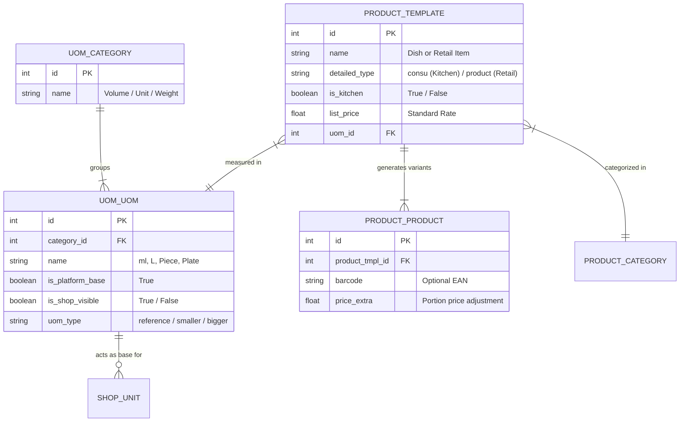

# Architectural Specification: Kitchen Extension & Two-Tier Unit System

**Document Version:** 1.0  
**Target Platform:** Odoo 18 Community + Custom React POS  
**Reference Codebase:** `production-hot-fix` (`CatalogManager.tsx`, `ProductForm.tsx`, `ProductsPage.tsx`)  
**Audience:** Product Designer & Technical Architects  

---

## 1. Executive Summary

This specification standardizes two foundational catalog capabilities for ORSquare:
1. **The Kitchen Universal Extension:** Enables retail shops and bars to sell prepared food, beverages, and counter snacks without physical inventory tracking ("infinite stock"), fully integrated with sales billing, categories, taxes, and accounting.
2. **The Two-Tier Unit System:** Replaces fragile text-based unit strings with an enterprise-grade unit hierarchy:
   - **Tier 1 (Base Units):** Standard, non-deletable platform units (`ml`, `L`, `Piece`, `Pack`, `Plate`) with shop-level visibility toggles (eye icon).
   - **Tier 2 (Shop Units):** User-defined units derived from an approved Base Unit with a strict numeric ratio (e.g. `180 ml`, `750 ml`, `Pack of 10`), guaranteeing exact volume calculations for statutory and excise reporting.
3. **Legacy "Half Plate" Evolution:** Evaluates the legacy mechanism of creating duplicate products (e.g., `Paneer Tikka (Half)`) and provides an enterprise upgrade using native Odoo Product Variants under a simplified designer UI.
4. **Catalog Settings Navigation:** Renames the confusing "Catalog Option" gear drawer to **"Catalog Masters"** with dedicated sections for Base Units and Shop Units.

---

## 2. Topic 1: Kitchen Feature Architecture & Shop Consumables

### A. Universal Plugin Architecture
In ORSquare, **Kitchen is not a separate application or parallel database**. It is a universal feature toggle managed in **Business Studio**:
* **When Kitchen is Disabled (Default Liquor Retailer):**
  - All kitchen UI elements, kitchen categories, and dish creation buttons are hidden.
  - The catalog only presents standard retail products with warehouse stock tracking.
* **When Kitchen is Enabled (Bar, Pub, Restaurant, or Hybrid Counter):**
  - The Product Form gains a switch between **Retail Product** and **Kitchen Dish**.
  - A quick-filter toggle appears on `/products` (`All`, `Retail`, `Kitchen`).
  - The Sales checkout screen enables kitchen dish quick-selection.

```
┌─────────────────────────────────────────────────────────────────┐
│               Business Studio Feature Toggle                    │
│                 [✓] Enable Kitchen Extension                    │
└────────────────────────────────┬────────────────────────────────┘
                                 │
                 ┌───────────────┴───────────────┐
                 ▼                               ▼
       [Retail Product]                  [Kitchen Dish]
       • Tracked Storable                • Consumable ("Infinite Stock")
       • Godown & Counter Quants         • No Stock Moves / Zero Quants
       • Low Stock Alerts                • Direct Bill Line in POS
       • Supplier Purchases              • Portion Variants (Full / Half)
```

### B. Odoo 18 Native Mapping: "Infinite Stock" via Consumables
In standard Odoo 18 Community, every product defines a field `detailed_type`:
* `'product'` (Storable Product): Odoo tracks physical quants in locations (`WH/Stock/Counter`, `WH/Stock/Godown`). Selling deductions and delivery pickings are enforced.
* `'consu'` (Consumable Product): Odoo treats the item as a tangible good whose stock levels are **not tracked**. 
  - Stock levels are never counted, tracked, or blocked.
  - When billed on a POS or customer invoice, **no stock picking or stock move is generated**.
  - Billing succeeds infinitely, exactly matching the business requirement.
* Custom module addition (`orsquare`): A lightweight boolean flag `is_kitchen = fields.Boolean(default=False)` on `product.template` to differentiate prepared food from general retail consumables.

### C. Non-Kitchen Consumables (Counter Snacks, Peanuts, Cashews)
Retail shops frequently sell non-kitchen consumables such as packaged peanuts, cashews, soda, chips, water bottles, and disposable glasses.
ORSquare accommodates both commercial practices cleanly:
1. **Tracked Counter Snacks:** Packaged goods purchased from distributors in cases and sold at MRP.
   - Type: `detailed_type = 'product'` (Storable).
   - Stock: Deducted from Counter stock per sale.
   - Units: `Pack` or `Piece`.
2. **Untracked Counter Snacks / Complimentary Munchies:** Bulk-purchased nuts or snacks served without individual packet tracking.
   - Type: `detailed_type = 'consu'` (Consumable), `is_kitchen = False`.
   - Stock: Infinite stock at counter.
   - Units: `Plate`, `Bowl`, `Pack`, `Piece`.

---

## 3. Topic 2: Two-Tier Units of Measure System

### A. The Flaw of the Legacy Unit System
In `production-hot-fix` (`ProductForm.tsx` lines 210–226), units were handled via loose text inputs and fragile regex parsing (`normalizeUnitInput` checking for `/^\d+$/` and hardcoding string labels like `${n} ML`).
* If a user typed a custom label or abbreviation, statutory reporting could not calculate total liquid volume.
* There was no platform-level guarantee that `750 ML` and `0.75 LTR` mapped to the same underlying physical measure.

### B. Two-Tier Unit Architecture

```
┌─────────────────────────────────────────────────────────────────────────────┐
│                   TIER 1: STANDARD BASE UNITS (Platform-Level)              │
│       • Shipped & maintained by ORSquare. Immutable. Non-deletable.          │
│       • Controlled by Shop Owner via [Show / Hide] Visibility Eye Icon.     │
├──────────────┬──────────────┬──────────────┬──────────────┬─────────────────┤
│   ml (Vol)   │   L (Vol)    │ Piece (Unit) │  Pack (Unit) │  Plate (Kitchen)│
│  [Eye: ON]   │  [Eye: ON]   │  [Eye: ON]   │  [Eye: ON]   │    [Eye: OFF]   │
└──────┬───────┴──────────────┴──────┬───────┴──────────────┴─────────────────┘
       │                             │
       ▼                             ▼
┌──────────────────────────────┐ ┌───────────────────────────────────────────┐
│ TIER 2: SHOP UNITS (Derived) │ │ TIER 2: SHOP UNITS (Derived)              │
│ • Base Unit: ml              │ │ • Base Unit: Piece                        │
│ • 180 ml  → Ratio: 180       │ │ • 1 Piece    → Ratio: 1                   │
│ • 375 ml  → Ratio: 375       │ │ • Pack of 10 → Ratio: 10                  │
│ • 750 ml  → Ratio: 750       │ │ • Box of 24  → Ratio: 24                  │
│ • 1000 ml → Ratio: 1000      │ └───────────────────────────────────────────┘
└──────────────────────────────┘
```

#### Tier 1: Standard Base Units
* **Shipped Defaults:**
  1. `ml` (Milliliter - Volume)
  2. `L` (Liter - Volume)
  3. `Piece` (Item Count)
  4. `Pack` (Packaged Item)
  5. `Plate` (Kitchen Serving Portion)
  6. `Bowl` (Kitchen Serving Portion)
  7. `Kg` (Weight - Kilogram)
  8. `gm` (Weight - Gram)
* **Rules & Non-Destructive Hiding Guardrail:**
  - Base units cannot be deleted or created by users. They are platform-managed.
  - Shop owners have an **Eye / Toggle Control** to hide base units irrelevant to their business (e.g. a pure wine shop hides `Plate`, `Bowl`, and `Kg`).
  - **Non-Destructive Hiding Guarantee:** Hiding a Base Unit strictly removes it from new selection dropdowns and creation UIs. It **NEVER breaks, disables, or cascades to existing Shop Units or existing products**. Any product or derived shop unit already using that base unit continues to function, calculate volume, and display normally without error.
  - Re-enabling the Base Unit immediately restores it to creation dropdowns.


#### Tier 2: Shop Units / Product Units
* **Creation Rules:**
  - Every shop unit must be derived from an active Base Unit.
  - Form Fields:
    1. **Unit Name / Display Label:** e.g., `180 ml`, `750 ml`, `Half Plate`, `Case of 12`.
    2. **Base Unit Selector:** Dropdown restricted to active Tier 1 Base Units (`ml`, `Piece`, etc.).
    3. **Numeric Conversion Ratio:** Strict positive number representing the quantity of base units per 1 unit.
* **Mathematical Integrity:**
  $$\text{Total Volume (L)} = \sum \frac{\text{Quantity Sold} \times \text{Shop Unit Ratio in ml}}{1000}$$
  Because every unit is mathematically tied to a base unit, excise and statutory reports generate exact figures with zero ambiguity.

### C. Odoo 18 Backend Mapping (`uom.category` and `uom.uom`)
Standard Odoo provides an industrial-grade UoM engine:
* `uom.category`: Volume, Unit, Weight.
* `uom.uom`:
  - `uom_type`: `'reference'` (Base unit, e.g. Liter or Unit), `'smaller'` (`factor` > 1), `'bigger'` (`factor_inv` > 1).
  - ORSquare adds:
    - `is_platform_base = fields.Boolean(default=False)`
    - `is_shop_visible = fields.Boolean(default=True)`
    - `base_unit_id = fields.Many2one('uom.uom')`
    - `ratio = fields.Float(digits=(12, 4))`

---

## 4. Topic 3: Evaluation of Legacy "Half Plate" Implementation

### A. Deep Audit of Legacy Code (`production-hot-fix`)
In `ProductForm.tsx` (lines 574–592), the legacy codebase handled Half Plates with the following logic:
```typescript
if (editing.isKitchen && enablePortions && halfRate > 0 && !initialId) {
  await createProduct(shopId, {
    name: `${editing.name.trim()} (Half)`,
    barcode: '',
    category: editing.categoryId,
    unit: editing.unitId,
    mrp: halfRate,
    rate: halfRate,
    is_kitchen: true,
  })
}
```

### B. Critique of the 5 Legacy Defects
1. **Catalog Duplication:** Creating 40 kitchen dishes creates 80 distinct products in the database, cluttering master lists.
2. **Orphaned / Desynchronized Records:** Notice `!initialId`. The companion product was created **only on initial creation**. If the owner later edited the dish name, category, or prices, the "(Half)" product remained unchanged, permanently out of sync.
3. **Orphaned Deletions:** Deleting or archiving the main dish left the "(Half)" product lingering in the catalog.
4. **POS Friction:** In the cashier search bar, searching "Paneer" yielded two separate items (`Paneer Tikka` and `Paneer Tikka (Half)`), increasing cognitive load and checkout time.
5. **Fragmented Reporting:** Calculating total demand for "Paneer Tikka" required error-prone string regexes (`WHERE name LIKE '% (Half)'`) rather than clean aggregations.

### C. Comparison of Architectural Alternatives

| Evaluation Dimension | Option 1: Legacy Duplicate Products (`Name (Half)`) | Option 2: Odoo Product Variants (`product.attribute` "Portion") | Option 3: Custom Portion Pricing Matrix on Product |
|---|---|---|---|
| **Data Integrity** | ❌ High risk of desynchronized prices & names. | 🟢 **Guaranteed:** Single template controls category, taxes, and name. | 🟡 Good, but requires custom bill line schema. |
| **Catalog Cleanliness** | ❌ Bloats catalog by 2x. | 🟢 **Clean:** 1 Parent Dish Template. | 🟢 **Clean:** 1 Product record. |
| **POS Cashier UX** | ❌ 2 search results per dish. | 🟢 **Fast:** Tapping dish offers `[Full: ₹200]` or `[Half: ₹120]`. | 🟢 **Fast:** Tapping dish offers portion popup. |
| **Odoo Standard Reuse** | ❌ Antipattern (creates dummy clones). | 🟢 **100% Native:** Standard `product.template` + `product.product`. | 🟡 Custom fields on `product.template`. |
| **Reporting & Aggregation** | ❌ Broken without fuzzy string matching. | 🟢 **Native:** Reports total dish sales or breakdown by variant. | 🟡 Requires custom reporting queries. |
| **Complexity for User** | 🟡 Simple initially, messy later. | 🟢 **Zero complexity:** Presented as simple Full/Half price inputs in UI. | 🟡 Simple. |

### D. Final Recommendation
**Option 2 (Native Odoo Product Variants underneath, simple Portion Toggle in UI)** is the clear winner:
* **In the UI (Product Designer Experience):** The user simply sees:
  - `[✓] Offer Half & Full portions`
  - Full Portion Rate: `[ ₹ 200.00 ]`
  - Half Portion Rate: `[ ₹ 120.00 ]`
* **Under the Hood (Odoo Backend):**
  - Odoo creates a single `product.template` ("Paneer Tikka").
  - Odoo assigns standard attribute `Portion` with values `Full` and `Half`.
  - Both variants share the exact same category, kitchen classification, and accounting ledger.

---

## 5. Topic 4: Renaming & Redesigning the "Catalog Masters" Drawer

### A. The Renaming Decision
* **Legacy Label:** *"Catalogue Options"* (via gear icon in `ProductsPage.tsx`).
* **Problem:** "Option" sounds like personal display preferences (e.g. dark mode, table density). In reality, this screen manages authoritative master data.
* **New Recommended Name:** **"Catalog Masters"** (or **"Catalog Settings"**).
  - In retail ERP standards, categories, units, and brands are universally recognized as "Masters".

### B. Redesigned Layout for "Catalog Masters"
The drawer maintains three tabs: **Categories**, **Units**, and **Brands**.  
The **Units** tab is restructured into two clear, intuitive visual sections:

```
┌─────────────────────────────────────────────────────────────────────────┐
│ Catalog Masters                                                     [X] │
├─────────────────────────────────────────────────────────────────────────┤
│ [ Categories (6) ]        [ Units (12) ]               [ Brands (18) ]  │
├─────────────────────────────────────────────────────────────────────────┤
│                                                                         │
│ SECTION 1: STANDARD BASE UNITS                                          │
│ Shipped by ORSquare. Toggle visibility to match your shop type.         │
│                                                                         │
│ ┌───────────────────────────────────────────────┬─────────────────────┐ │
│ │ ml (Milliliter)                     [Volume]  │ [👁 Visible]        │ │
│ │ L (Liter)                           [Volume]  │ [👁 Visible]        │ │
│ │ Piece (Unit)                        [Count]   │ [👁 Visible]        │ │
│ │ Pack (Packaged)                     [Count]   │ [👁 Visible]        │ │
│ │ Plate (Serving)                     [Kitchen] │ [🚫 Hidden ]        │ │
│ │ Bowl (Serving)                      [Kitchen] │ [🚫 Hidden ]        │ │
│ │ Kg (Kilogram)                       [Weight]  │ [🚫 Hidden ]        │ │
│ └───────────────────────────────────────────────┴─────────────────────┘ │
│                                                                         │
│ SECTION 2: SHOP UNITS                                                   │
│ Sizes and packaging derived from approved base units.                   │
│                                                                         │
│ [+ Add Shop Unit]                                                       │
│ ┌──────────────────┬──────────────┬───────────────┬───────────────────┐ │
│ │ Unit Name        │ Base Unit    │ Value / Ratio │ Actions           │ │
│ ├──────────────────┼──────────────┼───────────────┼───────────────────┤ │
│ │ 180 ml           │ ml           │ 180           │ [Edit]  [Delete]  │ │
│ │ 375 ml           │ ml           │ 375           │ [Edit]  [Delete]  │ │
│ │ 750 ml           │ ml           │ 750           │ [Edit]  [Delete]  │ │
│ │ 1000 ml          │ ml           │ 1000          │ [Edit]  [Delete]  │ │
│ │ Pack of 10       │ Piece        │ 10            │ [Edit]  [Delete]  │ │
│ └──────────────────┴──────────────┴───────────────┴───────────────────┘ │
│                                                                         │
└─────────────────────────────────────────────────────────────────────────┘
```

---

## 6. Data Model Entity-Relationship Diagram


