# Odoo Module Architecture & Dependency Blueprint

> **Status review — 2026-10-07:** This is the module selection blueprint. Planned OCA reporting/period modules are not installed; current reports use native Odoo projections under decision D12. Evaluation labels below are historical assessments, not verified feature parity. See [current status](../STATUS.md).

**Project:** ORSquare (OR²)  
**Target Engine:** Odoo 18.0 Community Edition  
**Architecture Principle:** Standard Odoo First → Mature OCA Second → Thin Custom `orsquare` Module Last.

---

## 1. Architectural Hierarchy & Boundaries

```mermaid
graph TD
    subgraph Custom Layer
        ReactUI[ORSquare React Application]
        AstroSite[Astro Marketing Landing]
    end

    subgraph Thin Custom Odoo Module
        CustomMod[orsquare Custom Module]
        CustomMod --> CutoffLogic[Business-Day Cutoff Logic]
        CustomMod --> DaySealer[Daily Snapshot & Sealer]
        CustomMod --> ReAudit[Audited Re-Audit Service]
        CustomMod --> SaleService[Atomic Retail Sale Service]
        CustomMod --> OpenBottleMod[Open Bottle Peg Tracking]
        CustomMod --> DataWipe[Safe Data Wipe & Backup]
        CustomMod --> APILayer[Native Odoo JSON HTTP Controllers]
        CustomMod --> EventHook[Domain Event Publisher to Redis]
    end

    subgraph Mature OCA Community Modules
        OCAFin[OCA account_financial_report]
        OCAFiscal[OCA account_fiscal_year]
    end

    subgraph Official Odoo 18 Core Modules
        CoreStock[stock - Multi-location Godown, Counter & OP Stock]
        CoreAcc[account - Invoicing, Journals, Double-Entry]
        CoreL10n[l10n_in - Indian GST Localization]
        CorePurch[purchase - Vendor Orders & Bills]
        CoreProd[product & uom - Catalog, SKUs, Volumes]
        CoreHR[hr - Employee Directory & Partner Links]
        CorePOSRest[pos_restaurant - Optional Tables & Floors]
    end

    ReactUI -->|JSON HTTP Routes| APILayer
    APILayer --> CustomMod
    CustomMod --> OCAFin
    CustomMod --> OCAFiscal
    CustomMod --> CoreStock
    CustomMod --> CoreAcc
    CustomMod --> CoreL10n
    CustomMod --> CorePurch
    CustomMod --> CoreProd
    CustomMod --> CoreHR
```

---

## 2. Official Odoo Modules: What to Use and What to Avoid

### A. Official Modules to Use

| Module | Technical Name | Role in ORSquare |
|---|---|---|
| **Base** | `base` | User management (`res.users`), security groups (`res.groups`), multi-tenant companies (`res.company`), currencies. |
| **Invoicing & Accounting** | `account` | Double-entry general ledger, customer invoices (`out_invoice`), vendor bills (`in_invoice`), payments (`account.payment`), journals (Cash, Bank, Sale, Purchase). |
| **Indian Localization** | `l10n_in` | Indian GST compliance, HSN/SAC code tracking, automatic CGST/SGST/IGST tax calculation. |
| **Inventory & Stock** | `stock` | Two-location physical stock tracking (`WH/Stock/Godown` and `WH/Stock/Counter`), incoming shipments, internal transfers, real-time stock balances (`stock.quant`). |
| **Purchase** | `purchase` | Vendor purchase orders (`purchase.order`), vendor catalog pricing, incoming delivery generation, vendor bill creation. |
| **Product & Units** | `product`, `uom` | Master product catalog (`product.template`, `product.product`), barcodes, bottle sizes (ml volume units), standard purchase costs, selling prices. |
| **Employees** | `hr` | Employee records (`hr.employee`) linked directly to `res.partner` for tracking employee advances, loans, wages, and salary settlements. |
| **Employee Expenses** | `hr_expense` | Operational petty expenses and cash disbursements logged by staff. |
| **Restaurant Tables (Optional)** | `pos_restaurant` | Lightweight floor plan and table data models (`restaurant.floor`, `restaurant.table`), selectively queried when the shop enables the "Tables" feature. |

### B. Industry Packages Analysis: Bar & Lounge vs. Microbrewery

#### 1. "Bar & Lounge" Package
* **What it actually contains in Odoo:** It is not a separate engine. It is a configuration bundle that installs `point_of_sale`, `pos_restaurant`, `stock`, `account`, creates sample beverage categories, and enables the restaurant floor-plan view in Odoo's web client.
* **Assessment for ORSquare:** **Do NOT install the entire industry package.**
  * *Reason:* Installing the package injects unnecessary demo data, web client assets, and default views that we do not need.
  * *Selective Reuse:* We only need the underlying data models for tables (`restaurant.table` and `restaurant.floor`) from `pos_restaurant` if the shop toggles the "Tables" feature in Settings. Everything else is handled by our custom React billing UI.

#### 2. "Microbrewery" Package
* **What it actually contains in Odoo:** A bundle that installs `mrp` (Manufacturing), `stock`, `purchase`, `sale_management`, and configures Bills of Materials (BOMs) for batch brewing (grain, hops, yeast fermentation to keg).
* **Assessment for ORSquare:** 🚫 **STRICTLY AVOID.**
  * *Reason:* ORSquare is built for retail shops (liquor shops, beverage stores, convenience counters) that purchase pre-bottled products from distributors and sell them to customers. Installing `mrp` introduces huge database overhead, complex manufacturing routing, work centers, and unnecessary stock move validation steps that will slow down performance and complicate simple retail workflows.

---

## 3. Odoo Community vs. Enterprise Gap Analysis

Because ORSquare runs on **Odoo Community**, we must identify Enterprise features that are absent and provide battle-tested Community/OCA replacements.

| Enterprise Feature | Community Limitation | ORSquare Solution / OCA Replacement | Evaluation |
|---|---|---|---|
| **`account_accountant` & Dynamic Reports** (**as built:** native read-projection services cover trial balance, P&L, balance sheet, GST and registers — decision D12; OCA remains optional) | Community lacks dynamic interactive financial drill-downs (P&L, Balance Sheet, Aged Receivables, General Ledger). | **OCA `account_financial_report`** (from `OCA/account-financial-reporting` 18.0). Provides complete interactive Balance Sheet, P&L, Trial Balance, Partner Ledger, and Aged Balance. | 🟢 100% feature parity; zero code to maintain. |
| **Bank Reconciliation Widget** | Community has basic bank statement lines but lacks the interactive AI match widget. | Handled in custom UI: simple match of bank statements against open customer/supplier invoices via standard Odoo `account.payment` reconciliation. | 🟢 Clean, tailored to retail. |
| **Fiscal Year / Period Lock** | Community locks dates globally; lacks granular period closing. | **OCA `account_fiscal_year`** (from `OCA/account-closing` 18.0). Allows defining fiscal years and sealing closed dates. | 🟢 Standardized accounting practice. |
| **Barcode App** | Enterprise has a mobile barcode scanning web app. | **Handled in ORSquare React Frontend.** The React app directly interfaces with USB/Bluetooth barcode scanners (keyboard wedge) and camera scanners. No Odoo web client barcode app needed! | 🟢 Faster and completely offline-tolerant. |
| **PoS Kitchen Display (KDS) & Floor Editor** | Enterprise provides a visual drag-and-drop floor designer and kitchen screens. | **Handled in ORSquare React Frontend.** Visual table selector and optional kitchen order tickets are rendered natively in React; tables are stored in simple Odoo records. | 🟢 Sleeker, tailored to shop needs. |
| **Odoo Studio** | Enterprise drag-and-drop schema editor. | **Not needed.** We write clean, version-controlled Python models in the thin `orsquare` module. | 🟢 Better software engineering hygiene. |

---

## 4. What Genuinely Belongs in the Thin Custom `orsquare` Module

Following our prime engineering principle, the custom `orsquare` module must remain **thin and focused**. It must only contain logic that is truly unique to ORSquare:

### 1. Business-Day Cutoff Attribution
* **Problem:** Odoo records entries by UTC timestamp. Retailers who stay open until 2:00 AM need a 1:30 AM sale to belong to the previous business day.
* **Implementation:** Add an indexed field `orsquare_business_date` (Date) to `account.move`, `stock.move`, `account.payment`, and `purchase.order`. Automatically compute this field upon record creation based on the shop's configurable cutoff hour (e.g., 02:00 AM).

### 2. Business-Day Snapshot & Sealer (`orsquare.business_day`)
* **Problem:** Calculating historical daybook summaries live across thousands of historical lines slows down Calendar views and reports.
* **Implementation:** A dedicated model `orsquare.business_day` that captures:
  - Counted opening float.
  - Expected cash (net cash sales + cash receipts - cash payments - petty cash).
  - Counted closing cash and variance.
  - Total sales breakdown (Cash, UPI, Khata).
  - Sealed state (`open` -> `sealed`).
  - Read-optimized frozen snapshot data.

### 3. Controlled Re-Audit Service
* **Problem:** When a historical return or adjustment happens, reports must reflect the change without destructively overwriting past accounting records.
* **Implementation:** An audited service on `orsquare.business_day` that recalculates the figures for a specified past business date, updates the snapshot, and records an immutable log entry in `orsquare.day_audit_log` detailing who initiated the re-audit, previous figures, new figures, and reasons.

### 4. Atomic Retail Sale Orchestration Service
> **As built:** the sale is a native `pos.order`, not a hand-built invoice/payment/picking trio (decision D1 in
> [`backend-decisions.md`](backend-decisions.md)). `orsquare.sale.service.settle()`:
> 1. resolves the business date and rejects dated documents in a sealed day (live ones roll to the next day);
> 2. locks the quant rows, verifies Counter stock and pulls the shortfall from the Godown when enabled;
> 3. creates the `pos.order` with server-computed taxes, then payments (cash/UPI/Khata/concession), delivery
>    (`Counter → Customer`, pegs from their bottle location) and, on request, the GST invoice;
> 4. is idempotent on `client_ref`, and rolls everything back together on any failure.
> Khata leaves the amount on the customer's receivable when the Daybook session closes.

### 5. Open Bottle Peg Tracking (`orsquare.opened_bottle`)
> **As built:** the record stores **no volume**; each bottle owns a child location of `Opened` and remaining ml is derived from its quant (D4).
* Dedicated model to track individual opened bottles transferred from Counter stock to OP Stock.
* Tracks original volume (ml), remaining volume (ml), status (`active`, `empty`, `wasted`).
* Dispenses configured portion sizes (30ml, 60ml, 90ml, etc.) and accurately recognizes proportional Cost of Goods Sold (COGS).
* Integrates with `stock.scrap` to record spillage, breakage, or un-sellable residuals.

### 6. Godown-to-Counter Stock Transfer Service
* Simple, one-click service to move stock from Godown to Counter via standard Odoo `stock.picking` of type `internal`.

### 7. Safe Data Control & Shop Data Wipe
* A secure administrative service that verifies two-step confirmation, creates an automated pre-wipe database backup, and cleanly purges transactional data (`account.move`, `stock.move`, `pos.order`) while keeping master data (Chart of Accounts, products, partners, locations) 100% intact.

### 8. Native Odoo JSON Controller API
* Exposes clean, typed endpoints via native Odoo HTTP JSON controllers (`@http.route(type='json', auth='user')`) for the React frontend, handling single-roundtrip bootstrap hydration (`/api/sync/bootstrap`), incremental deltas, offline outbox flush (`/api/sync/flush`), customer khata lookups, and settings. Zero external sidecar dependency.

### 9. Real-Time Domain Event Hook (Redis Publisher)
* Upon transaction commit, emits a lightweight 100-byte domain event (`sale_settled`, `stock_transferred`) to Redis Pub/Sub for Centrifugo fan-out to connected screens in <10 ms.
