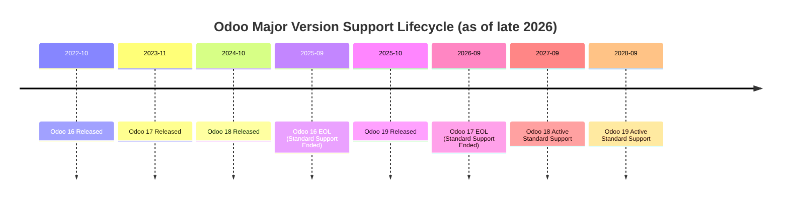

# Odoo Version Analysis & Selection Report

> **Status review — 2026-10-07:** Historical version-selection research supporting the locked Odoo 18 baseline. Ecosystem/support assertions below have not been freshly verified; planned OCA availability must not be treated as installed functionality. See [current status](../STATUS.md).

**Target Engine Evaluation:** Odoo 16 vs Odoo 17 vs Odoo 18 vs Odoo 19  
**Target Edition:** Odoo Community Edition  
**Target Market & Geography:** Retail shops (beverage & bottle retail, food/table service option) in India  

---

## 1. Overview of Odoo Release Cycle & Support Model

Odoo operates on an annual major release cycle (every October) and maintains a rolling **three-version standard support window**.

* **Odoo 16:** Released October 2022. Standard official support ended in September 2025. Now in unsupported/legacy phase.
* **Odoo 17:** Released November 2023. Standard official support ended in September 2026.
* **Odoo 18:** Released October 2024. Active standard support runs through September 2027.
* **Odoo 19:** Released late 2025. Active standard support runs through September 2028.

---

## 2. In-Depth Comparative Matrix

| Evaluation Dimension | Odoo 16.0 | Odoo 17.0 | Odoo 18.0 | Odoo 19.0 |
|---|---|---|---|---|
| **Official Support Status** | ❌ End of Life (2025) | ❌ End of Life (2026) | ✅ Active (Supported to late 2027) | ✅ Active (Supported to late 2028) |
| **Python Runtime Compatibility** | Python 3.10 | Python 3.10 / 3.11 | Python 3.10 / 3.11 / 3.12 | Python 3.11 / 3.12 / 3.13 |
| **PostgreSQL Compatibility** | PG 12 – 15 | PG 13 – 16 | PG 14 – 17 | PG 15 – 17+ |
| **ORM & Performance Architecture** | Standard ORM; slower batch operations | Modernized ORM; OWL 2 transition | **Rewritten query caching, optimized batch operations for inventory and journal moves** | Incremental micro-optimizations over v18 |
| **Indian Localization (`l10n_in`)** | Basic GST; older e-invoice flows | Stable GST e-invoicing; HSN mapping | **Most polished GST, HSN/SAC compliance, updated tax report grids, e-way bill APIs** | Early-stage bug-fixing on new localization rules |
| **OCA Ecosystem Maturity** | Complete but legacy-frozen | Very mature | **Fully mature; active 18.0 branches across all major repos (accounting, pos, rest)** | Many OCA modules still in pull-request or porting phase |
| **Headless / API Readiness** | XML-RPC / JSON-RPC / older `base_rest` | JSON-RPC / `base_rest` | **Native Odoo HTTP JSON controllers (zero-dependency, stable WSGI) + JSON-RPC** | Early experimental sidecar architectures |
| **Stock & Inventory Engine** | Standard multi-location | Standard | **Offline-capable inventory logic, high-volume batch moves, optimized quants** | Minor refinements |
| **Upgrade & Migration Path** | Legacy migration required | Migration debt starting | **Optimal sweet spot: 2+ years of standard support remaining** | Bleeding-edge instability |

---

## 3. Deep Dive Analysis by Version

### Odoo 16.0 (Legacy — Disqualified)
* **Verdict:** ❌ **Do not use.**
* **Rationale:** Odoo 16 is officially past its standard support window. Running a greenfield enterprise project in 2026 on an unsupported base creates immediate technical debt. Security patches are no longer issued upstream by Odoo S.A., and third-party libraries (Python 3.10) are aging.

### Odoo 17.0 (Mature but Exiting Support — Disqualified)
* **Verdict:** ❌ **Do not use for a new build.**
* **Rationale:** While Odoo 17 was a major UI overhaul (introducing OWL 2 and new view architectures), it has just exited Odoo's 3-year official support window. Starting a new product on v17 guarantees that ORSquare would need an expensive engine migration almost immediately after launch.

### Odoo 18.0 (The Recommended Gold Standard)
* **Verdict:** 🏆 **STRONGLY RECOMMENDED.**
* **Key Advantages:**
  1. **Peak Ecosystem Stability:** Odoo 18 has been in production globally for over two full years. All core regressions have been identified and patched in minor releases (18.0.x).
  2. **OCA 18.0 Repository Maturity:** The Odoo Community Association (OCA) has completed ports of all critical modules needed for ORSquare:
     - `OCA/account-financial-reporting` (18.0 branch active) — gives Odoo Community enterprise-grade P&L, Balance Sheet, and Trial Balance reports.
     - `OCA/account-closing` (18.0 branch active) — provides `account_fiscal_year` for closing locks.
     - `OCA/pos` (18.0 branch active) — barcode and receipt helpers.
  3. **High-Throughput Performance:** Odoo 18 introduced heavily optimized ORM query batching. For a high-traffic retail counter billing multiple items per minute and moving stock between Godown and Counter, Odoo 18 exhibits significantly lower database contention and lower latency than v16 or v17.
  4. **Headless API Stability:** Native Odoo HTTP JSON controllers (`@http.route(type='json', auth='user')`) eliminate third-party ASGI sidecar complexity and interface directly with Odoo's thread pool.
  4. **Indian Statutory Compliance (`l10n_in`):** Odoo 18 includes the latest Indian GST rate matrices, HSN/SAC classifications, CGST/SGST/IGST split accounting, and updated electronic tax filing formats.
  5. **Active Support Window:** Odoo 18 enjoys active upstream bug fix and security support through late 2027.

### Odoo 19.0 (Bleeding Edge — Too Early)
* **Verdict:** ⚠️ **Not recommended for immediate development.**
* **Rationale:** While Odoo 19 is the newest version, building on it today exposes ORSquare to "early adopter tax":
  1. Key OCA modules (especially complex reporting and REST framework libraries) are either still in open pull requests or only partially tested on 19.0.
  2. Community documentation, community forum solutions, and production bug reports are scarce compared to 18.0.
  3. When bugs occur in v19, it is difficult to determine whether the issue lies in custom code or upstream Odoo bugs.

---

## 4. Final Recommendation & Conclusion

For ORSquare's underlying engine, **Odoo 18.0 Community Edition** is unequivocally the best choice. It delivers:
* Maximum runtime stability with zero bleeding-edge friction.
* Complete availability of OCA Community replacements for Enterprise accounting.
* Modern Python 3.11/3.12 performance.
* Complete alignment with Indian GST (`l10n_in`).
* Over a year of active official support remaining, with a clean future upgrade path to 19 or 20 when OCA 19/20 fully matures.
