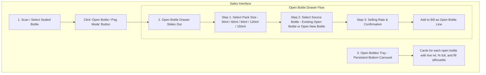
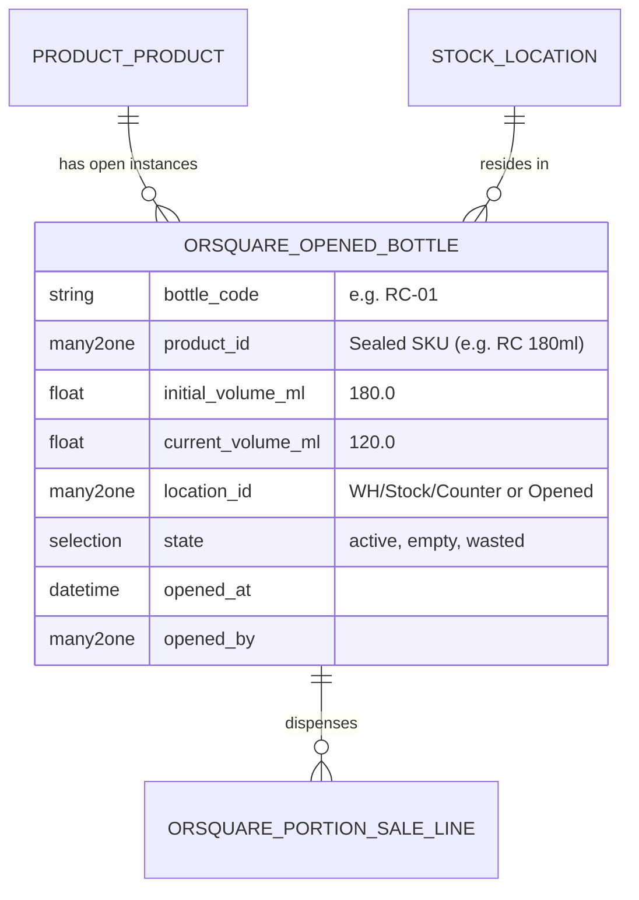

# Open Bottles (Portion & Peg Sales) Technical Specification

**Project:** ORSquare (OR²)  
**Domain:** Portion sales from opened liquor/wine bottles (e.g., 30ml, 60ml, 90ml pegs from 750ml, 375ml, or 180ml bottles)  
**Reference Designs:** [`C:\Users\rushi\Desktop\ref\01.png`](file:///C:/Users/rushi/Desktop/ref/01.png) and [`C:\Users\rushi\Desktop\ref\02.png`](file:///C:/Users/rushi/Desktop/ref/02.png)  

---

## 1. Product Requirements & User Experience

### A. The Business Problem
In retail liquor stores and counter bars, customers frequently buy partial quantities rather than full sealed bottles:
* Single Peg (30 ml)
* Standard Peg (60 ml)
* Large Peg / Quarter (90 ml)
* Double Peg (120 ml)
* Patiala Peg (150 ml)

Retailers need to open a sealed bottle from stock, sell portions from it over time, track the remaining volume in milliliters, and see all currently opened bottles at a glance.

---

### B. User Interface Design (Based on Reference Mockups)

#### 1. The Open Bottles Tray (Bottom Carousel)
* Located persistently along the bottom of the Sales POS screen (see [`01.png`](file:///C:/Users/rushi/Desktop/ref/01.png) and [`02.png`](file:///C:/Users/rushi/Desktop/ref/02.png)).
* Shows all currently opened bottles (e.g. `RC #01`, `RC #02`, `Old Monk #01`, `Royal Stag #01`).
* Each card displays:
  - **Bottle Identifier & Name:** E.g., `RC #01 - Royal Challenge Premium Whisky`.
  - **Bottle Total Size:** E.g., `180 ml`, `750 ml`.
  - **Visual Fill Level Silhouette:** A graphical bottle illustration filled to its exact percentage:
    - 🟢 **Healthy (>50% full):** Green fill indicator.
    - 🟡 **Mid (25% – 50% full):** Amber fill indicator.
    - 🔴 **Low / Finish (<25% full):** Red fill indicator with `FINISH PEG` badge.
  - **Remaining Volume:** Explicitly shows `120 ml left (66%)`, `60 ml left (33%)`, etc.
  - **Timestamp:** Time opened (e.g. `Opened 18:20`).
* Clicking any bottle in the tray directly initiates a portion sale from that specific bottle.

#### 2. The Open Bottle Drawer (Right Slide-Out Panel)
* **Step 1 — Select Pack Size:** Quick-tap chips for valid configured sizes: `30 ml` (Single), `60 ml` (Peg), `90 ml` (Large), `120 ml` (Double), `150 ml` (Patiala).
* **Step 2 — Select Source Bottle:** Shows existing opened bottles that have enough volume for the requested portion, highlighting the **[RECOMMENDED]** bottle (the oldest open bottle to ensure inventory rotation). If none exist or staff opens a new one, offers an **"Open New Bottle from Counter Stock"** option.
* **Step 3 — Selling Rate:** Displays standard portion rate (e.g. ₹120 for 60ml peg), with optional manual override if permitted.
* **Line Item in Cart:** Added as a distinct line: E.g., `Royal Challenge Peg 60ml (Bottle #RC-01) - 60ml remaining after bill | Rate: ₹120.00`.

---

## 2. Inventory & Accounting Architecture in Odoo 18

A common pitfall is storing opened bottles as a simple custom quantity field on the product. This corrupts stock valuation, breaks double-entry ledgers, and causes stock discrepancies.

ORSquare models opened bottles with **full accounting and inventory rigor**:

### A. Data Modeling in `orsquare` Module

### B. Inventory Movement Lifecycle

1. **Opening a New Bottle:**
   * When Bottle #RC-01 is opened, the system moves **1 unit** of `product.product` (Royal Challenge 180ml) from `WH/Stock/Counter` into a designated sub-location: `WH/Stock/Opened` (or marks it as opened via `orsquare.opened_bottle`).
   * The sealed Counter stock decreases by 1 unit; the opened bottle registry gains an active record with `current_volume_ml = 180.0`.
2. **Dispensing Portions:**
   * Selling a 60ml portion deducts `60.0` from `current_volume_ml` on Bottle #RC-01.
   * Sealed bottle inventory is **not** touched again because the physical bottle was already accounted for upon opening.
3. **Emptying the Bottle:**
   * When `current_volume_ml` reaches `0.0`, the bottle status automatically transitions to `empty`. It drops off the active Open Bottles Tray and archives cleanly.

---

### C. Financial & Cost of Goods Sold (COGS) Accounting

Double-entry accounting requires that revenue and cost match accurately per portion:

* **Revenue Recognition:** The portion sale is billed at its configured peg rate (e.g. ₹120 for 60ml) with appropriate GST taxes (`l10n_in`).
* **Proportional COGS Recognition:**
  When a portion is sold, Odoo recognizes Cost of Goods Sold proportional to the dispensed volume:
  $$\text{Portion COGS} = \left(\frac{\text{Portion ml}}{\text{Initial Bottle ml}}\right) \times \text{Bottle Cost Price}$$
  * *Example:* If a 180ml bottle has a purchase cost of ₹150, a 60ml portion incurs:
    $$\text{COGS} = \left(\frac{60}{180}\right) \times ₹150 = \frac{1}{3} \times ₹150 = ₹50.00$$
  * Gross Profit on that peg = ₹120.00 (selling price) - ₹50.00 (COGS) = **₹70.00**.

---

### D. Wastage, Spillage & Breakage

If an opened bottle drops, spoils, or has an un-sellable residual (e.g. 15 ml remaining that cannot make a full peg):
* The salesperson or manager clicks **"Write-off Remaining Volume"** from the bottle card.
* Enters reason: *Spillage*, *Breakage*, or *Evaporation / Residual*.
* The system writes off the remaining volume and posts an Odoo inventory scrap entry (`stock.scrap`) charging the remaining cost to the **Wastage / Spillage Expense Account**.
* The bottle transitions to `wasted` state, keeping physical counts 100% auditable.

---

### E. Daybook Stock Reconciliation

During the end-of-day Daybook closing ritual:
* The Sheet and Daybook list all active opened bottles.
* The closing staff physically verifies the bottles against the tray.
* Any unrecorded volume shortage (e.g., bottle expected 120ml but contains 60ml) is flagged by the Daybook audit reconciler as an **unscanned peg sale** or **unrecorded spillage**, allowing the owner to post the correct document.
