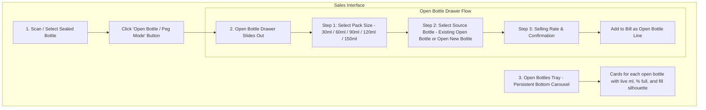
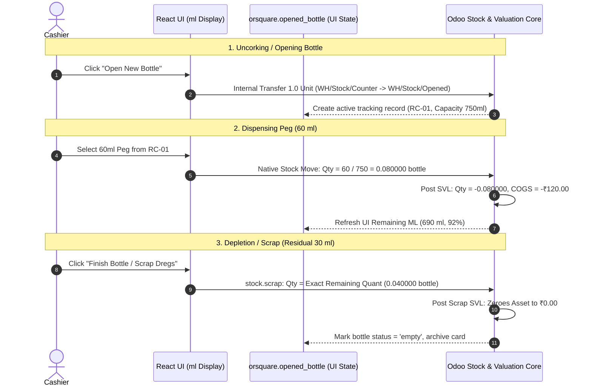

# Open Bottles (Portion & Peg Sales) Technical Specification

**Project:** ORSquare (OR²)  
**Domain:** Portion sales from opened liquor/wine bottles (e.g., 30ml, 60ml, 90ml pegs from 750ml, 375ml, or 180ml bottles)  
**Reference Designs:** [`C:\Users\rushi\Desktop\ref\01.png`](file:///C:/Users/rushi/Desktop/ref/01.png) and [`C:\Users\rushi\Desktop\ref\02.png`](file:///C:/Users/rushi/Desktop/ref/02.png)  

---

## 1. Product Requirements & User Experience

### A. The Business Problem
In retail liquor stores and counter bars, customers frequently buy partial quantities rather than full sealed bottles:
* Single Peg (30 ml)
* Standard Peg (60 ml)
* Large Peg / Quarter (90 ml)
* Double Peg (120 ml)
* Patiala Peg (150 ml)

Retailers need to open a sealed bottle from stock, sell portions from it over time, track the remaining volume in milliliters, and see all currently opened bottles at a glance.

---

### B. User Interface Design (Based on Reference Mockups)

#### 1. The Open Bottles Tray (Bottom Carousel)
* Located persistently along the bottom of the Sales POS screen (see [`01.png`](file:///C:/Users/rushi/Desktop/ref/01.png) and [`02.png`](file:///C:/Users/rushi/Desktop/ref/02.png)).
* Shows all currently opened bottles (e.g. `RC #01`, `RC #02`, `Old Monk #01`, `Royal Stag #01`).
* Each card displays:
  - **Bottle Identifier & Name:** E.g., `RC #01 - Royal Challenge Premium Whisky`.
  - **Bottle Total Size:** E.g., `180 ml`, `750 ml`.
  - **Visual Fill Level Silhouette:** A graphical bottle illustration filled to its exact percentage:
    - 🟢 **Healthy (>50% full):** Green fill indicator.
    - 🟡 **Mid (25% – 50% full):** Amber fill indicator.
    - 🔴 **Low / Finish (<25% full):** Red fill indicator with `FINISH PEG` badge.
  - **Remaining Volume:** Explicitly shows `120 ml left (66%)`, `60 ml left (33%)`, etc.
  - **Timestamp:** Time opened (e.g. `Opened 18:20`).
* Clicking any bottle in the tray directly initiates a portion sale from that specific bottle.

#### 2. The Open Bottle Drawer (Right Slide-Out Panel)
* **Step 1 — Select Pack Size:** Quick-tap chips for valid configured sizes: `30 ml` (Single), `60 ml` (Peg), `90 ml` (Large), `120 ml` (Double), `150 ml` (Patiala).
* **Step 2 — Select Source Bottle:** Shows existing opened bottles that have enough volume for the requested portion, highlighting the **[RECOMMENDED]** bottle (the oldest open bottle to ensure inventory rotation). If none exist or staff opens a new one, offers an **"Open New Bottle from Counter Stock"** option.
* **Step 3 — Selling Rate:** Displays standard portion rate (e.g. ₹120 for 60ml peg), with optional manual override if permitted.
* **Line Item in Cart:** Added as a distinct line: E.g., `Royal Challenge Peg 60ml (Bottle #RC-01) - 60ml remaining after bill | Rate: ₹120.00`.

---

## 2. Inventory & Accounting Architecture in Odoo 18

A critical failure mode in previous iterations was treating custom models or volume fields as an independent inventory ledger. This caused calculation drift, race conditions, and corrupted financial valuations.

In ORSquare, **Odoo stock quantities (`stock.quant`), stock moves (`stock.move`), stock valuation layers (`stock.valuation.layer`), and double-entry accounting ledgers are the sole authoritative truth for stock and valuation.**

### A. The Single Inventory Authority Invariant
* The operational model `orsquare.opened_bottle` is strictly an operational tracking and UI presentation record.
* It references the underlying stock item and location, facilitating UI display (active bottle cards, visual fill level, ml remaining).
* **`remaining_volume_ml` must never become a second inventory authority.** Physical volume remaining is derived directly from (or validated against) the authoritative stock quant in the Opened location (`WH/Stock/Opened`).
* No parallel stock, costing, or valuation ledger is maintained.

---

### B. Core Architectural Model: Alternative B (Fractional UoM with 6-Decimal Precision)

ORSquare uses standard Odoo stock moves with fractional bottle quantities to record portion sales directly against the opened stock quant:

$$\text{Portion Move Quantity (bottles)} = \frac{\text{Portion Volume (ml)}}{\text{Bottle Total Capacity (ml)}}$$

* **Example (750 ml Bottle):** Selling a 60 ml peg executes a stock move of $\frac{60}{750} = 0.080000$ bottle from `WH/Stock/Opened` to `Partner Locations/Customers`.
* **Example (700 ml Bottle):** Selling a 60 ml peg executes a stock move of $\frac{60}{700} = 0.085714$ bottle.
* **Cost Recognition:** Odoo's native AVCO stock valuation layers calculate and post exact Cost of Goods Sold (COGS) without any custom costing engine:
  $$\text{Portion COGS} = \text{Portion Move Quantity} \times \text{Bottle Unit Cost}$$

---

### C. Precision Specification & Invariant Qualification

> [!IMPORTANT]
> **Precision Invariant Qualification:**  
> **ORSquare uses 6-decimal precision for the bottle UoM as the validated minimum for the tested bottle/portion combinations. This is an implementation requirement backed by automated regression tests, not a universal mathematical guarantee for every possible future bottle size or portion. Any new supported bottle/portion configuration must pass the same valuation/conservation tests.**

* **Minimum Safe Configuration:**
  - `decimal.precision` for `'Product Unit of Measure'` = **6 digits**.
  - Bottle Unit of Measure (`uom.uom`) `rounding` = **`0.000001`**.
* **Container-Level Verification Mandate:** The runtime behavior of `decimal.precision` and `uom.uom.rounding` must be verified against the exact Odoo 18 Community container build used in production, as UoM precision behavior and rounding interactions can vary across environments.
* **Strict UI Boundary:** Cashiers and store owners interact purely in physical milliliters (`ml`); fractional bottles (e.g. `0.085714`) are strictly internal backend quantities and are never exposed in the user interface.

---

### D. Inventory Movement Lifecycle

1. **Opening a New Bottle:**
   * Moves **1.0 unit** of `product.product` from `WH/Stock/Counter` into `WH/Stock/Opened`.
   * Sealed Counter stock decreases by 1 unit; Opened location gains 1 unit.
   * `orsquare.opened_bottle` creates an active tracking record referencing the product, lot/serial (if tracked), and location.
2. **Odoo-Native Fractional Stock Movement for Portion Dispensing:**
   * Dispensing a portion executes an Odoo-native stock move from `WH/Stock/Opened` to the customer location with quantity $=\frac{\text{ml}}{\text{Capacity ml}}$ (to 6 decimals).
   * Odoo quant in `WH/Stock/Opened` decrements by the exact fraction.
   * Odoo native AVCO valuation generates the exact SVL and posts COGS journal entries automatically.
3. **Residual Wastage & Zeroing Invariant:**
   * When the bottle is empty or the remaining liquid is scrapped (e.g. 15–40 ml spillage/dregs), the write-off executes an Odoo `stock.scrap` evaluated against the **exact stored remaining quant** (`scrap_qty = remaining_quant`).
   * This cleanly zeroes out the physical quant in `WH/Stock/Opened` to **`0.000000`** and flushes the residual Balance Sheet asset value to **`₹0.00`**, leaving zero phantom stock dust or stranded accounting pennies in the database.
   * The tracking record transitions to `empty` or `wasted` and archives cleanly from the active tray.

---

### E. Permanent Automated Invariant Regression Suite

The 5-bottle empirical multi-step conservation tests proven during Milestone 0 are preserved as permanent automated regression tests inside the `orsquare` test suite (`orsquare/tests/test_opened_bottles.py`):
1. **750 ml Bottle:** ₹1,500 cost, multi-step pegs (60, 60, 90, 120, 60, 90, 180, 60 ml) + 30 ml scrap $\rightarrow$ 0.0 paise drift.
2. **700 ml Bottle:** ₹2,100 cost, non-terminating fractions ($60/700 = 3/35$) $\rightarrow$ 0.0 paise drift.
3. **650 ml Bottle:** ₹260 cost, non-terminating fractions ($200/650 = 4/13$) $\rightarrow$ 0.0 paise drift.
4. **375 ml Bottle:** ₹900 cost, pint fractions $\rightarrow$ 0.0 paise drift.
5. **1,000 ml Bottle:** ₹2,500 cost, 1-liter fractions $\rightarrow$ 0.0 paise drift.

Every test rigorously asserts:
* Stored quant at completion $== 0.000000$.
* Remaining Balance Sheet asset value $== ₹0.00$.
* Cumulative COGS + Scrap Loss $== \text{Initial Bottle Purchase Cost}$.
