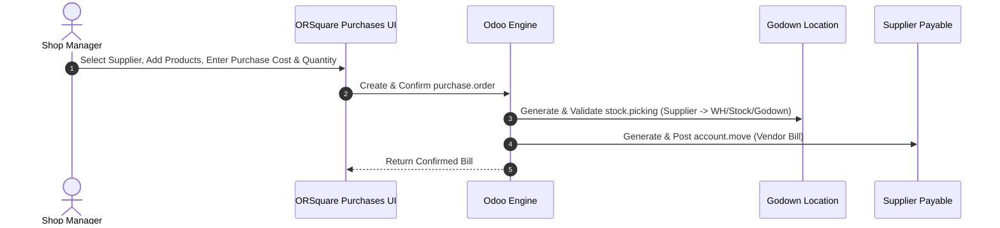

# Retail Operational Workflows & Technical Specification

**Project:** ORSquare (OR²)  
**Domain:** Bottle, Beverage & General Retail Operations  
**Architecture:** Headless Odoo Community 18.0 Engine + Custom React Frontend  

---

## 1. Dashboard

### User Experience & Philosophy
The Dashboard is an operational summary screen answering three critical questions in under five seconds:
1. **How is today doing?**
2. **What is my cash and payment breakdown?**
3. **What is my stock worth and where is it located?**

It is strictly a **read-only** view; it never mutates transactions directly. Every card provides a 1-click drill-down to the tab owning the underlying records.

### Metrics & Data Sourcing
* **Today's Total Sales:** Sum of all customer invoices (`account.move` with `move_type='out_invoice'`) where `orsquare_business_date = current_business_date`.
* **Payment Breakdown:**
  * **Cash:** Sum of `account.payment` linked to Cash Journal.
  * **UPI / Online:** Sum of `account.payment` linked to Bank/UPI Journal.
  * **Khata (Credit):** Sum of outstanding balances from credit invoices created on the current business day.
* **Simple Profit:** Gross revenue minus Cost of Goods Sold (COGS). For cashiers or employees without `can_see_valuation` permission, this metric is cleanly masked with a dash (never displayed as zero).
* **Weekly Trend:** 7-day bar/line chart plotting sales across the last seven finalized business days.
* **Stock Value by Location:** Total valuation of inventory in **Godown** vs **Counter** (`stock.quant` quantity × `standard_price`).

---

## 2. Accounts (Customers, Suppliers, Employees)

### Overview
Accounts is the party directory managing the three fundamental financial relationships of a retail shop.

### A. Customers & Khata (Credit)
* **Model:** `res.partner` with `customer_rank > 0`.
* **Receivable Account:** `100100 Accounts Receivable` (standard Odoo receivable).
* **Khata Workflow:**
  1. A cashier bills a trusted customer with payment method "Khata".
  2. The invoice is validated and posted, creating a Debit on Accounts Receivable.
  3. When the customer comes back to pay off their balance (partial or full):
     - Cashier opens customer's account in Accounts.
     - Enters payment amount and mode (Cash or UPI).
     - System posts an inbound `account.payment` and automatically reconciles it against the customer's open invoices.
* **Balance Calculation:** Sum of unreconciled debit journal lines on the customer's receivable account. Server-derived; no client math.

### B. Suppliers & Payables
* **Model:** `res.partner` with `supplier_rank > 0`.
* **Payable Account:** `200100 Accounts Payable` (standard Odoo payable).
* **Workflow:**
  1. Unpaid or credit purchases from a supplier create a Credit on Accounts Payable.
  2. Paying the supplier (bank transfer or cash) records an outbound `account.payment`, reducing the payable.

### C. Employees (Wages, Advances, Loans)
* **Model:** `hr.employee` linked to a corresponding `res.partner`.
* **Financial Transactions:**
  * **Salary / Wage Payment:** Standard payroll or expense voucher debiting Wage Expense and crediting Cash/Bank.
  * **Staff Advance / Loan:** Outbound payment debited to an Employee Advance Asset account (`100200 Employee Advances`).
  * **Recovery / Repayment:** Deducted from monthly wages or repaid in cash, crediting the Advance account.

---

## 3. Purchases & Supplier Procurement

### Purpose
Purchases records all stock bought from distributors, increases inventory, lands stock in the **Godown**, and logs the supplier bill.

### Technical Workflow


### Business Rules
* **Cost vs. MRP:** The purchase rate entered is strictly the purchase cost (unit cost price). It must never be confused with MRP or selling price.
* **Godown Arrival:** All purchased stock lands in `WH/Stock/Godown`. It is not sale-ready until transferred to the Counter.
* **Unit of Measure Conversions:** Supports buying in cases/boxes and storing in pieces/bottles using standard Odoo `uom.uom` conversions (e.g. 1 Case = 12 Bottles).

---

## 4. Products Master Catalog & Two-Tier Units

### Structure & Naming Conventions
In beverage and bottle retail, confusing variants, brands, and bottle sizes causes major calculation bugs. ORSquare enforces standard nomenclature:
* **Brand / Product Family (`product.template`):** E.g. *Royal Stag*, *Kingfisher Premium*.
* **Bottle Size / Volume (`uom.uom` or attribute):** E.g. *750 ml*, *375 ml*, *180 ml*, *90 ml*.
* **Variant / Flavor (attribute):** Distinct product variations (e.g. *Green Apple*, *Smooth*).
* **Portion Variant (attribute):** Kitchen dish sizes (e.g. *Full*, *Half*) linked to a single parent template, eliminating legacy duplicate products (`Name (Half)`).
* **SKU (`product.product`):** The exact barcode-bearing sellable item (e.g. *Royal Stag 750ml*).

### Product Classification
* **Retail Product:** Physical storable inventory (`detailed_type = 'product'`). Tracked in Godown and Counter with quants, low-stock alerts, and internal transfers.
* **Kitchen Dish (Universal Extension):** Infinite stock consumable (`detailed_type = 'consu'`, `is_kitchen = True`). Sold directly at POS without inventory deductions or delivery pickings. No recipes, BOMs, or kitchen costing at this stage.
* **Shop Consumables (Packaged snacks, peanuts, cashews):** Can be configured as tracked storables (`detailed_type = 'product'`) or untracked counter items (`detailed_type = 'consu'`) with standard units (`Piece`, `Pack`, `Plate`).

### Two-Tier Unit Standardization System
To guarantee exact liquid volume calculations for excise/statutory reporting and eliminate fragile string regexes, units follow a strict two-tier hierarchy:
1. **Tier 1: Standard Base Units (Platform Shipped):**
   * Built-in platform units: `ml`, `L`, `Piece`, `Pack`, `Plate`, `Bowl`, `Kg`, `gm`.
   * Immutable: Users cannot delete them and cannot create new base units.
   * Controlled via shop-level **Visibility Toggle (Eye icon)** to display only units relevant to the retailer.
   * **Non-Destructive Guardrail:** Hiding a Base Unit strictly removes it from new creation dropdowns; existing Shop Units and products continue to work, calculate volume, and display without breaking. Re-enabling restores it.

2. **Tier 2: Shop Units / Product Units (Shop Managed):**
   * Created by the shop owner from an active, visible Base Unit.
   * Fields: Unit Name (e.g. `180 ml`, `Pack of 10`), Base Unit (`ml`, `Piece`), and a strict Numeric Ratio (`180`, `10`).
   * Mathematical conversion guarantee:
     $$\text{Total Liters} = \sum \frac{\text{Qty Sold} \times \text{Shop Unit Ratio in ml}}{1000}$$

### Catalog Masters Drawer
Renamed from *"Catalog Options"* to **"Catalog Masters"** to reflect authoritative enterprise master data:
* **Categories:** Retail categories and kitchen food sections.
* **Units:** Two dedicated sections: Standard Base Units (with visibility toggles) and Shop Units (with base unit and numeric ratio).
* **Brands:** Umbrella brand families for sheet and register grouping.

### Opening Stock Handling
* During shop onboarding, initial stock on hand is accepted **once** per product.
* Handled as an Odoo Inventory Adjustment (`stock.quant` update or opening inventory move), rather than an editable balance field. Once created, future changes must occur via Purchases, Sales, or audited Adjustments.

---

## 5. Sales & Counter Billing

### Purpose
The high-traffic point-of-sale checkout counter. Must be instantaneous, keyboard-navigable, and support rapid barcode scanning.

### Checkout Sequence
1. **Product Scan / Search:** Cashier scans barcode or types product short code / name.
2. **Stock Validation vs. Infinite Kitchen Stock:**
   * **Retail Products (`detailed_type = 'product'`):** Instant visual feedback verifying availability in `WH/Stock/Counter`.
   * **Kitchen Dishes & Consumables (`detailed_type = 'consu'`):** Bypasses physical stock check; displays an infinite availability badge (`∞`).
3. **Line Customization, Portions & Open Bottle Pegs:**
   * Adjust quantity; apply permitted discount or price override.
   * **Portion Selection:** For kitchen dishes with portion rates, cashier selects `[Full: ₹200]` or `[Half: ₹120]` chips directly.
   * **Open Bottle Peg Flow:** Launch the **Open Bottle Drawer** to dispense configured peg portions (30ml, 60ml, 90ml) from active bottles.
4. **Payment Mode Selection:**
   * **Cash:** Exact change or tendered amount calculator.
   * **UPI / QR:** Direct QR display or manual confirmation.
   * **Khata (Credit):** Customer selector with current outstanding balance indicator.
   * **Split Payment:** Partial Cash + partial UPI.
5. **Confirm & Complete:** Atomic transaction via `orsquare` service:
   * Validates business day is not closed.
   * For retail goods: Deducts items from `WH/Stock/Counter` (or ml from active `orsquare.opened_bottle`).
   * For kitchen/consumables: Bypasses delivery pickings, creating only the invoice and payment lines.
   * Posts customer invoice and reconciles payment.
   * Emits domain event to Redis for instant Centrifugo real-time fan-out.
   * Generates bill number and triggers silent thermal printing.

---

## 6. Stock: Godown, Counter & OP Stock Management

### The Three-Location Inventory Topology
In beverage retail, stock theft and discrepancies are prevented by maintaining clear physical locations:

```
[Supplier] ──Purchases──▶ [ Godown (Bulk Reserve) ]
                                   │
                           Internal Transfer
                                   ▼
[Customer] ◀──Sales────── [ Counter (Sale-Ready) ]
                                   │
                              Open Bottle
                                   ▼
                        [ OP Stock (Opened Shelf) ]
```

* **Godown (`WH/Stock/Godown`):** Back-room locked storage where cases are held. Customers cannot buy directly from here.
* **Counter (`WH/Stock/Counter`):** Sale-ready front shelf. The Sales POS billing screen only consumes stock from this location.
* **OP Stock (`WH/Stock/Opened`):** Active opened bottles being dispensed in peg portions. Tracked in milliliters via `orsquare.opened_bottle`.

### Stock Transfer Workflow
* Cashier or stockkeeper selects "Transfer Stock".
* Chooses items and quantities to move from Godown to Counter.
* Posts an Odoo internal transfer (`stock.picking` of type `internal`), immediately updating available counter stock.

---

## 7. Cash Flow vs. Accounts: Architectural Analysis & Recommendation

### The Question
Should Cash Flow remain a separate area, become a reporting layer, or be merged conceptually with Accounts?

### Deep Technical Analysis
* **In Accounting Reality (Odoo Backend):**
  There is NO separate "Cash Flow" table. Every cash inflow and outflow is already recorded as an `account.move.line` against liquidity accounts (`account.journal` of type `cash` or `bank`).
* **In Retail User Mental Models:**
  * **Accounts** is **entity-centric** ("Who is Ramesh? How much does he owe me? What is ABC Distributors' payable?").
  * **Cash Flow** is **temporal & operational** ("How much hard cash entered my physical drawer today? How much did we pay the delivery boy for tea/cleaning? What is our net liquid cash right now?").

### Architecture Recommendation
* **Backend:** Unified 100% on standard Odoo double-entry journals (`account.journal` and `account.payment`). Zero duplicate tables.
* **Frontend UI Recommendation:**
  * **Keep Cash Flow as a distinct, dedicated operational register tab.**
  * Do **NOT** hide it inside an advanced accounting menu.
  * *Why?* A retail shopkeeper needs to inspect daily cash movements (petty cash, expenses, daily takings, owner withdrawals) multiple times a day without navigating through customer lists or complex balance sheets. Keeping it as a clean "Cash Flow / Money In-Out" register gives retailers clarity while maintaining complete accounting purity underneath.

---

## 8. Daybook: Cash Session & Closing Ritual

### Overview
The Daybook manages the daily operational cash session from shop opening to shop closing.

### Workflow
1. **Opening Float:** At morning opening, the cashier counts and enters the cash in the drawer (e.g. ₹5,000 opening float).
2. **During the Day:**
   Live expected cash is computed dynamically:
   $$\text{Expected Cash} = \text{Opening Float} + \text{Cash Sales} + \text{Customer Cash Receipts} - \text{Supplier Cash Payments} - \text{Cash Expenses}$$
3. **Closing Ritual:**
   * Cashier enters physical cash counted in drawer.
   * System highlights any variance (Surplus or Shortage).
   * Cashier prints the Closing Stock list from the register.
   * Cashier confirms closing and seals the daybook session.
   * Creates an immutable record in `orsquare.business_day`.

---

## 9. Calendar: Business-Day Cutoff & Controlled Re-Audit

### Configurable Business-Day Cutoff
* **Retail Reality:** Beverage shops and bars frequently operate past midnight (closing at 1:00 AM, 1:30 AM, or 2:00 AM).
* **Cutoff Rule:**
  * Configured in shop settings (default: `02:00` IST).
  * A transaction occurring at `2026-10-07 01:30 AM` has an `orsquare_business_date` of `2026-10-06`.
  * The new business day begins strictly after `02:00 AM`.

### Finalization & Snapshot
* Once a business day is sealed, its summary figures (total sales, payment splits, profit, cash variance) are frozen in `orsquare.business_day`.
* When viewing historical dates in Calendar, the system loads the frozen snapshot in under 20 milliseconds, eliminating heavy historical table scans.

### Controlled Re-Audit Mechanism
* **The Problem:** A customer returns a bottle today from a sale that occurred two days ago, or an auditor corrects an erroneous past expense.
* **The Solution:**
  1. The return or adjustment is posted as a proper Odoo credit note / reversal move linked to the original transaction.
  2. In the Calendar, an authorized owner views that past date and clicks **"Re-audit"**.
  3. The system executes `orsquare.business_day.action_reaudit()`:
     - Recalculates the day's financial metrics incorporating linked adjustments.
     - Logs an immutable entry in `orsquare.day_audit_log` recording:
       - Who initiated the re-audit (`res.users`).
       - Timestamp of re-audit.
       - Exact previous snapshot vs updated snapshot values.
       - Reason entered by the owner.
     - Updates the finalized day status to `re_audited`.
  4. This preserves 100% accounting and inventory auditability with zero dirty overwrites.

---

## 10. Settings, Teams & Access

### Settings Sections
* **Appearance:** Theme toggle (light/dark/compact density), visual preferences.
* **Bill & Invoice:**
  * Receipt size: Thermal 80mm / 58mm POS receipt vs. Full A4 Tax Invoice.
  * Shop header details, GSTIN, custom receipt footer message.
  * Silent printing toggle (QZ Tray / Web Print).
* **Features:** Optional feature toggles (Kitchen classification, Table billing, Quick discount).
* **Tables Mode:** Enables floor and table selection in Sales for restaurant/bar environments, querying `pos_restaurant` table models.

### Teams & Access Control
* Uses native Odoo `res.users` and security groups (`res.groups`):
  * **Shop Owner / Administrator:** Full access to all tabs, valuation, costs, reports, re-audit, and settings.
  * **Cashier:** Restricted to Sales, Daybook, and basic Accounts lookup. Cost price and profit metrics are masked.
  * **Stockkeeper:** Restricted to Stock, Purchases, and Product catalog. Financial reports and drawer cash are masked.
