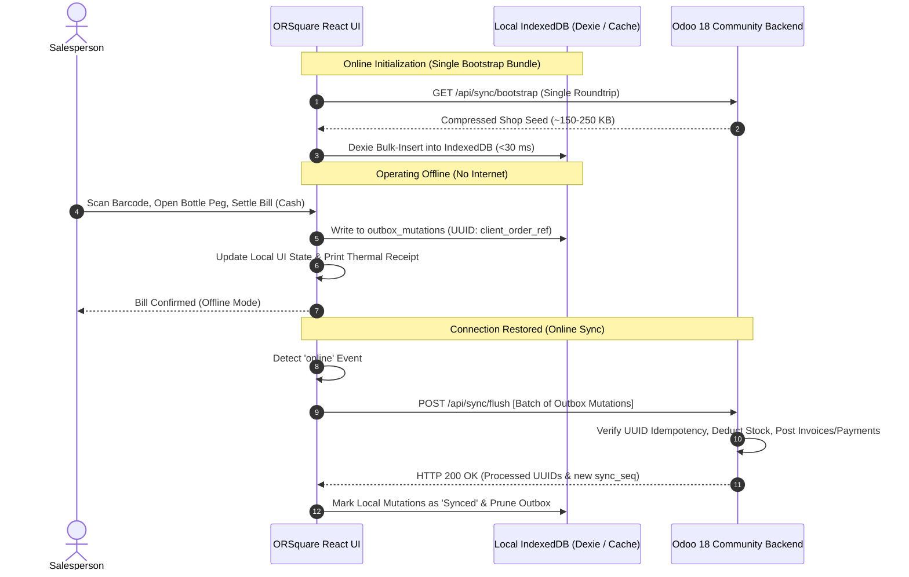

# Tenancy and Offline POS Architecture Evaluation

**Project:** ORSquare (OR²)  
**Evaluation Scope:** 
1. Tenancy Model: Separate Database per Shop vs. Single-Database Multi-Company.
2. Offline POS Architecture: Odoo 18 POS (OWL) Reuse vs. Headless React + IndexedDB Sync.

---

## 1. Tenancy Model Evaluation

### The Core Question
Should ORSquare use a **separate Odoo database per shop (Database-per-Tenant)** or a **single database with Odoo Multi-Company (`res.company`)**?

> [!NOTE]
> The user explicitly simplified the product scope: **one account = one shop = one database**, eliminating cross-shop multi-store ownership.

```mermaid
graph TD
    subgraph Option A: Database per Shop (Recommended)
        ReqA[HTTP Request: shop1.orsquare.com] --> NginxA[Reverse Proxy / Router]
        NginxA --> OdooA[Odoo 18 Instance]
        OdooA --> DBA[(Database: orsquare_shop1)]
        OdooA --> DBB[(Database: orsquare_shop2)]
        OdooA --> DBC[(Database: orsquare_shop3)]
    end

    subgraph Option B: Single Database Multi-Company
        ReqB[HTTP Request] --> OdooB[Odoo 18 Instance]
        OdooB --> SingleDB[(Single Database: orsquare_all)]
        SingleDB --> Comp1[Company 1 Records]
        SingleDB --> Comp2[Company 2 Records]
    end
```

### Comparative Analysis Matrix

| Evaluation Dimension | Option A: Database-per-Shop (Separate DB) | Option B: Multi-Company in Single DB |
|---|---|---|
| **Data Isolation & Security** | 🟢 **Absolute.** Physical separation at PostgreSQL level. Zero risk of cross-tenant data leaks. | 🔴 **Vulnerable.** Relies on `company_id` filter in every query and record rule (`ir.rule`). A single missing check leaks data. |
| **"Wipe Shop Data" Safety** | 🟢 **Trivial & Safe.** Can drop, truncate, or wipe `orsquare_shop1` with zero risk of touching other shops. | 🔴 **High Hazard.** Wiping requires `DELETE ... WHERE company_id = X`. A foreign key cascade bug can destroy other shops' records. |
| **Backup & Point-in-Time Recovery**| 🟢 **Granular & Instant.** Each shop is an independent `pg_dump` file. Can restore Shop A to yesterday without affecting Shop B. | 🔴 **Monolithic.** Restoring a backup overwrites data for all 100+ shops simultaneously. |
| **Database Lock Contention** | 🟢 **Zero Cross-Shop Contention.** High-speed billing in a busy bar never locks inventory rows or sequences in another shop. | 🔴 **Shared Bottleneck.** Heavy concurrent transactions lock sequence counters (`ir.sequence`) and shared cache tables. |
| **PostgreSQL Resource Overhead** | 🟡 **Moderate.** PostgreSQL handles 50–200 small databases effortlessly with connection pooling. Shared buffers are shared across databases. | 🟢 **Slightly Lower Memory.** Only one database schema in memory. |
| **Module Migrations & Upgrades** | 🟡 **Requires Iterative Scripts.** Upgrading `orsquare` requires running an upgrade loop across tenant databases. | 🟢 **Single Command.** One migration updates all tenants at once. |

### Verdict & Architectural Recommendation
**Option A (Separate Database per Shop) is strongly recommended.**

* **Why?** Since cross-shop consolidation has been removed, Multi-Company offers no functional advantage while introducing massive data-leak risks, complex multi-tenant row locking, and severe operational hazards for the "Wipe Shop Data" feature. 
* Database-per-shop provides complete physical isolation, trivial point-in-time backups, effortless tenant migrations, and makes shop-level wipes completely isolated and safe.

---

## 2. Offline POS Architecture Evaluation

### The Core Question
Can we reuse Odoo 18 POS's existing offline architecture, or do we implement client-side offline queueing in our custom React frontend?

### How Odoo 18 Point of Sale Operates Offline
* **Frontend Tech Stack:** Odoo 18's POS frontend is built using **OWL (Odoo Web Library)**, Odoo's proprietary component framework. It is tightly coupled to OWL reactive stores (`pos_store.js`), XML/QWeb templates, and Odoo assets.
* **Storage Engine:** When a POS session is opened online, Odoo's `data_service.js` pre-downloads the product catalog, partners, taxes, and prices into the browser's **IndexedDB**.
* **Offline Execution:** If network connectivity drops:
  - Orders are added to IndexedDB.
  - The UI displays an "offline" status indicator.
  - Receipt printing continues locally.
* **Sync Protocol (`sync_from_ui`):**
  - When connection is restored, the POS frontend pushes stored orders to the backend endpoint: `pos.order.create_from_ui()`.
  - The server creates `pos.order` records, updates inventory quants, and marks orders as synced.

### Can We "Re-skin" Odoo POS with our React UI?
* **Verdict:** ❌ **Not practical or maintainable.**
* **Reason:** You cannot "re-skin" Odoo POS in React without rewriting its OWL components or embedding React inside OWL. OWL and React are two competing single-page application runtimes with different virtual DOMs, state managers, and event loops. Trying to skin Odoo's OWL app with React would create an unstable, bloated hybrid that would break on every minor Odoo update.

### The Superior Solution: Reuse the Odoo POS Sync Protocol in React

Instead of fighting OWL, the optimal approach is:



### Key Technical Rules for Offline POS in ORSquare
1. **Idempotency Keys:** Every sale generated on the frontend receives a unique client UUID (`client_order_ref`). If the network disconnects mid-sync and retries, Odoo detects the existing UUID and returns the confirmed order without double-posting stock or money.
2. **Monotonic Sequence Ordering:** Each shop maintains an auto-incrementing `sync_seq`. Devices apply events in strict sequence order, eliminating out-of-order race conditions.
3. **Single Bootstrap Bundle:** Initial app load fetches a single compressed workspace seed (`/api/sync/bootstrap`), completely eliminating the legacy waterfall of 20+ sequential network requests. Subsequent loads render from local IndexedDB instantly, followed by incremental catch-up (`/api/sync/delta`).
4. **Physical Stock Conflict Handling:** If two offline registers sell the same last physical unit, both sales are accepted into the append-only sales log upon reconnection. Physical stock discrepancies are flagged and surfaced during the **Daybook closing physical count audit** for owner reconciliation, reflecting physical reality without disrupting completed checkouts.
5. **Benchmark Target Principle:** Specific metrics (e.g. sub-millisecond local queries, ~150ms bootstrap, ~200KB bundle sizes) are treated as **benchmark engineering targets**, to be rigorously measured and validated against actual code during implementation.
6. **Restricted Offline Actions:**
   - **Allowed Offline:** Cash sales, manual UPI entry, scanning cached products, open bottle peg sales from existing cached open bottles, thermal receipt printing, stock transfers (queued).
   - **Blocked Offline (Requires Warning):** Customer Khata credit increases beyond credit limit (server balance check needed), adding new products, and Daybook closing snapshot sealing (requires server lock).
